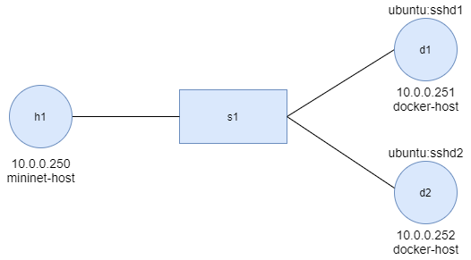

# Mininet延伸環境 -- Containernet & Mininet-wifi

## containernet

containernet為mininet的延伸，他可以將mininet的host以docker進行取代

### 啟動containernet
>在此使用老師的虛擬機

* 切換containernet
  
```sh
cd /home/user/containernet
python3 ./setup.py install
```

* 進行測試
  
```sh
cd /home/user/containernet/examples
python3 dockerhost.py
```
> 確認docker image是否存在
> 

### ssh安裝
* 啟動鏡像
`docker run -it ubuntu:trusty bash`

* 在容器中新增使用者
`useradd user`
`passwd user`

* 在容器上安裝ssh並開啟
>需先執行`apt update`進行更新

`apt install openssh-server`
`/etc/init.d/ssh start`
  
* 測試


* 將容器儲存成鏡像sshd1
`docker commit [contain id] [name]`

>在重複以上動作生成sshd2，使用者為tom

### 實驗環境



### 程式碼內容

```sh
#!/usr/bin/python
"""
This is the most simple example to showcase Containernet.
"""
from mininet.net import Containernet
from mininet.node import Controller
from mininet.cli import CLI
from mininet.link import TCLink
from mininet.log import info, setLogLevel
setLogLevel('info')

net = Containernet(controller=Controller)
info('*** Adding controller\n')
net.addController('c0')
info('*** Adding docker containers\n')
h1 = net.addHost('h1', ip='10.0.0.250/24')
d1 = net.addDocker('d1', ip='10.0.0.251/24', dimage="ubuntu:sshd1")
d2 = net.addDocker('d2', ip='10.0.0.252/24', dimage="ubuntu:sshd2")
info('*** Adding switches\n')
s1 = net.addSwitch('s1')
info('*** Creating links\n')
net.addLink(h1, s1)
net.addLink(d1, s1)
net.addLink(d2, s1)
info('*** Starting network\n')
net.start()
info('*** Running CLI\n')
CLI(net)
info('*** Stopping network')
net.stop()
```

### 實驗結果

* 執行程式
```python3 containernet.py```

* 啟動xterm開啟h1
```xterm h1```

* 以bash開啟mn.d1並啟動ssh
```docker exec -it mn.d1 bash```
```/etc/init.d/ssh start```


## 實驗二
>利用**字典攻擊法**破解ssh的密碼

* 安裝軟體
```apt install hydra```

* 準備2個字典檔,一個存放帳號(user.txt)，另一個存放密碼(password.txt)
  
* 在h1執行```hydra -L user.txt -P password.txt 10.0.0.254 ssh -t 4```


## quagga
>用來實現動態路由

### 安裝quagga
```docker pull kathara/quagga```

### 實驗環境


### 程式碼內容
>在此使用**ospf**

```sh
#!/usr/bin/env python

from mininet.net import Containernet 
from mininet.cli import CLI
from mininet.link import TCLink, Link
from mininet.log import info, setLogLevel
 
if '__main__' == __name__:
  setLogLevel('info')
  net = Containernet()
  h1 = net.addHost('h1')
  h2 = net.addHost('h2')
  r1 = net.addDocker('r1', dimage="kathara/quagga:latest", volumes=["/home/user/Downloads/dynamic_routing/r1/quagga:/etc/quagga"])
  r2 = net.addDocker('r2', dimage="kathara/quagga:latest", volumes=["/home/user/Downloads/dynamic_routing/r2/quagga:/etc/quagga"])
  r3 = net.addDocker('r3', dimage="kathara/quagga:latest", volumes=["/home/user/Downloads/dynamic_routing/r3/quagga:/etc/quagga"])
  net.addLink(h1, r1)
  net.addLink(h2, r2)
  net.addLink(r1, r2)
  net.addLink(r1, r3)
  net.addLink(r2, r3)
  net.build()
 
  r1.cmd("ifconfig r1-eth0 0")
  r1.cmd("ifconfig r1-eth1 0")
  r1.cmd("ifconfig r1-eth2 0")
  r2.cmd("ifconfig r2-eth0 0")
  r2.cmd("ifconfig r2-eth1 0")
  r2.cmd("ifconfig r2-eth2 0")
  r3.cmd("ifconfig r3-eth0 0")
  r3.cmd("ifconfig r3-eth1 0")
  r1.cmd("ip addr add 192.168.1.254/24 brd + dev r1-eth0")
  r1.cmd("ip addr add 12.1.1.1/24 brd + dev r1-eth1")
  r1.cmd("ip addr add 13.1.1.1/24 brd + dev r1-eth2")
  r2.cmd("ip addr add 192.168.2.254/24 brd + dev r2-eth0")
  r2.cmd("ip addr add 12.1.1.2/24 brd + dev r2-eth1")
  r2.cmd("ip addr add 23.1.1.2/24 brd + dev r2-eth2")
  r3.cmd("ip addr add 13.1.1.3/24 brd + dev r3-eth0")
  r3.cmd("ip addr add 23.1.1.3/24 brd + dev r3-eth1")
  r1.cmd("/etc/init.d/quagga restart")	
  r2.cmd("/etc/init.d/quagga restart")
  r3.cmd("/etc/init.d/quagga restart")
  h1.cmd("ifconfig h1-eth0 0")
  h1.cmd("ip address add 192.168.1.1/24 dev h1-eth0")
  h1.cmd("ip route add default via 192.168.1.254 dev h1-eth0")
  h2.cmd("ifconfig h2-eth0 0")
  h2.cmd("ip address add 192.168.2.1/24 dev h2-eth0")
  h2.cmd("ip route add default via 192.168.2.254 dev h2-eth0")
  CLI(net)
  net.stop()
```
### 查看路由表

* 執行程式
```python3 dynamic_routing.py```

* 進入容器
```docker exec -it mn.r1 bash```

* 執行quagga
  ```telnet localhost 2604```
  * rip:2601
  * ospf:2604
>密碼為**zebra**


> 如果不能執行quagga，可以確認
> 1.資料夾是否成功掛載
> 2.檔案權限是否開啟

* 查看路由表
>須進入**enable**介面

```show ip ospf route```

### 測試
* 未中斷連線


* 將r1到r2連線中斷


## Mininet-wifi
>使用**MiniEdit**建置基本環境

### 切換環境

```sh
cd /home/user/mininet-wifi
util/install.sh -n
```
### 環境建置


### 程式碼內容

```sh
#!/usr/bin/python

from mininet.log import setLogLevel, info
from mn_wifi.net import Mininet_wifi
from mn_wifi.node import Station, OVSKernelAP
from mn_wifi.cli import CLI
from mn_wifi.link import wmediumd
from mn_wifi.wmediumdConnector import interference
from subprocess import call


def myNetwork():

    net = Mininet_wifi(topo=None,
                       build=False,
                       link=wmediumd,
                       wmediumd_mode=interference,
                       ipBase='10.0.0.0/8')

    info( '*** Adding controller\n' )
    info( '*** Add switches/APs\n')
    ap1 = net.addAccessPoint('ap1', cls=OVSKernelAP, ssid='ap1-ssid',
                             channel='1', mode='g', position='331.0,232.0,0')
    ap2 = net.addAccessPoint('ap2', cls=OVSKernelAP, ssid='ap2-ssid',
                             channel='1', mode='g', position='446.0,198.0,0')

    info( '*** Add hosts/stations\n')
    sta1 = net.addStation('sta1', ip='10.0.0.1',
                           position='266.0,359.0,0')
    sta2 = net.addStation('sta2', ip='10.0.0.2',
                           position='402.0,360.0,0')

    info("*** Configuring Propagation Model\n")
    net.setPropagationModel(model="logDistance", exp=3)

    info("*** Configuring wifi nodes\n")
    net.configureWifiNodes()

    info( '*** Add links\n')
    net.addLink(sta1, ap1)
    net.addLink(sta2, ap1)

    net.plotGraph(max_x=1000, max_y=1000)

    info( '*** Starting network\n')
    net.build()
    info( '*** Starting controllers\n')
    for controller in net.controllers:
        controller.start()

    info( '*** Starting switches/APs\n')
    net.get('ap1').start([])
    net.get('ap2').start([])

    info( '*** Post configure nodes\n')

    CLI(net)
    net.stop()


if __name__ == '__main__':
    setLogLevel( 'info' )
    myNetwork()
```

### 程式執行
> 要先關閉網路
> ```systemctl stop NetworkManager```

```python mininet-wifi.py```


### 基本操作

* `iwconfig` : 列出station的資訊


* `iw dev sta1-vlan0 scan`: 掃描附近基地台數量，並列出資訊
  

---
### 課程資料
* [Static routing vs Dynamic Routing (Quagga: RIPv2) ](http://csie.nqu.edu.tw/smallko/sdn/routing.htm)
* [YouTube -- mininet(containernet)-server 5](https://youtu.be/N-afnAxcK7g)