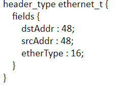
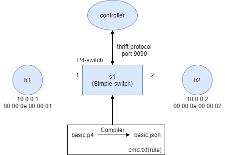
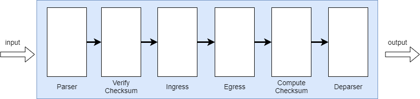
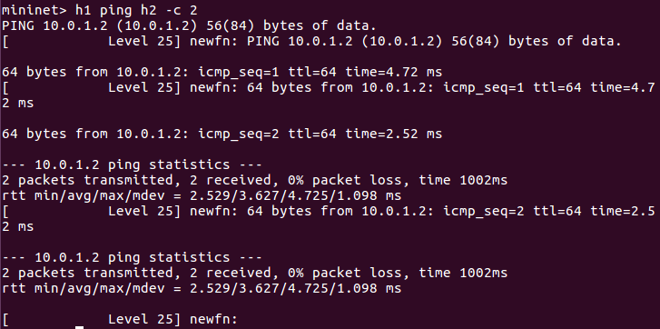
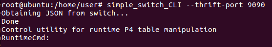
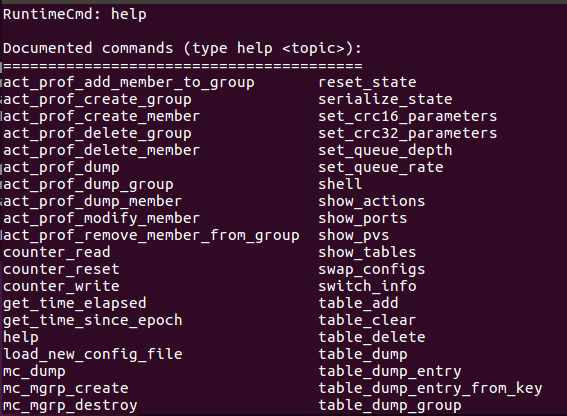

# P4(Program Proticol - Independent Packet Processors)(1)

[toc]

## 介紹
* 雖然OpenFlow從早期的1.0版表頭支援12個欄位到現在1.5版支援到45個欄位，但它的功能還是不足以滿足現今的需求。
* 早期OpenFlow1.0的設計方式為bottom-up，缺點為設計者必須考慮底層才能進行上層的設計，而P4他的設計方式為top-down， 所以不需考慮底層就能進行設計。

* 在OpenFlow中，當封包要進行傳送時，若switch中沒有規則時，將會將由控制器下放規則給switch讓封包可以進行傳送，但如果當控制器無法連線時，switch就無法傳送，封包就進行丟棄。而P4剛好可以透過他所提供的一些元件將狀態進行儲存，當控制器失去連線時讓封包能夠正常傳送。

* P4有2種版本，14版本和16版本，14版本可以轉換成16版本
  * 14
  
    

  * 16
  
    

## 實驗一 
為physical layer forwarding，使用框架為[nsg-ethz/p4-utils](https://github.com/nsg-ethz/p4-utils)

### 實驗環境



* simple_switch所使用的的底層架構為**V1 model**

    

  * Parser : 將header進行拆解，以得到header資訊
  * Verify Checksum : 確認checksum
  * Ingress : 封包進來處理動作
  * Egress : 封包出去處理動作
  * Compute Checksum : 重新計算checksum
  * Deparser : 將header重新組合

* Ingress的匹配
  * exact : 完全匹配
  * lpm :longest profix match
  * ternary
  * range

### 程式碼內容

使用**p4-utils**框架基本上需要3個檔案: **basic.p4**、**p4app.json**和**cmd.txt**

* basic.p4

```sh
/* -*- P4_16 -*- */
#include <core.p4>
#include <v1model.p4>

/*************************************************************************
*********************** H E A D E R S  ***********************************
*************************************************************************/
 
struct metadata {
    /* empty */
}

 

struct headers {
}

 

/*************************************************************************
*********************** P A R S E R  ***********************************
*************************************************************************/

parser MyParser(packet_in packet,
                out headers hdr,
                inout metadata meta,
                inout standard_metadata_t standard_metadata) {

    state start {
        transition accept;
    }

}

 

/*************************************************************************

************   C H E C K S U M    V E R I F I C A T I O N   *************

*************************************************************************/

 

control MyVerifyChecksum(inout headers hdr, inout metadata meta) {  
    apply {  }
}

/*************************************************************************
**************  I N G R E S S   P R O C E S S I N G   *******************
*************************************************************************/
control MyIngress(inout headers hdr,
                  inout metadata meta,
                  inout standard_metadata_t standard_metadata) {
    action drop() {
        mark_to_drop(standard_metadata);
    }

    action forward(bit<9> port) {
        standard_metadata.egress_spec = port;
    }

    # 定義table
    table phy_forward {
        key = {
            standard_metadata.ingress_port: exact;
        }


        actions = {
            forward;
            drop;
        }
        size = 1024;
        default_action = drop();
    }

    apply {
        phy_forward.apply();
    }
}

/*************************************************************************
****************  E G R E S S   P R O C E S S I N G   *******************
*************************************************************************/

control MyEgress(inout headers hdr,
                 inout metadata meta,
                 inout standard_metadata_t standard_metadata) {
    apply {  }
}

/*************************************************************************
*************   C H E C K S U M    C O M P U T A T I O N   **************
*************************************************************************/

control MyComputeChecksum(inout headers  hdr, inout metadata meta) {
     apply {
    }
}

/*************************************************************************
***********************  D E P A R S E R  *******************************
*************************************************************************/

control MyDeparser(packet_out packet, in headers hdr) {
    apply {
    }
}

/*************************************************************************
***********************  S W I T C H  *******************************
*************************************************************************/

V1Switch(
MyParser(),
MyVerifyChecksum(),
MyIngress(),
MyEgress(),
MyComputeChecksum(),
MyDeparser()

) main;
```

* p4app.json

```sh
{
  "program": "basic.p4",
  "switch": "simple_switch",
  "compiler": "p4c",
  "options": "--target bmv2 --arch v1model --std p4-16",
  "switch_cli": "simple_switch_CLI",
  "cli": true,
  "pcap_dump": true,
  "enable_log": true,
  "topo_module": {
    "file_path": "",
    "module_name": "p4utils.mininetlib.apptopo",
    "object_name": "AppTopoStrategies"
  },
  "controller_module": null,
  "topodb_module": {
    "file_path": "",
    "module_name": "p4utils.utils.topology",
    "object_name": "Topology"
  },
  "mininet_module": {
    "file_path": "",
    "module_name": "p4utils.mininetlib.p4net",
    "object_name": "P4Mininet"
  },
  "topology": {
    "links": [["h1", "s1"], ["h2", "s1"]],
    "hosts": {
      "h1": {
      },
      "h2": {
      }
    },
    "switches": {
      "s1": {
        "cli_input": "cmd.txt",
        "program": "basic.p4"
      }
    }
  }
}
```

* cmd.txt

```sh
# 執行動作/表格名稱/執行動作/匹配 => 執行動作
table_add phy_forward forward 1 => 2
table_add phy_forward forward 2 => 1
```
### 實驗結果

* 使用`p4run`執行

* `h1 ping h2`



* 進入switch操作

```sh
simple_switch_CLI --thrift-port 9090
```



> 若要得知此switch可以執行甚麼動作，可以使用`help`查詢
> 
