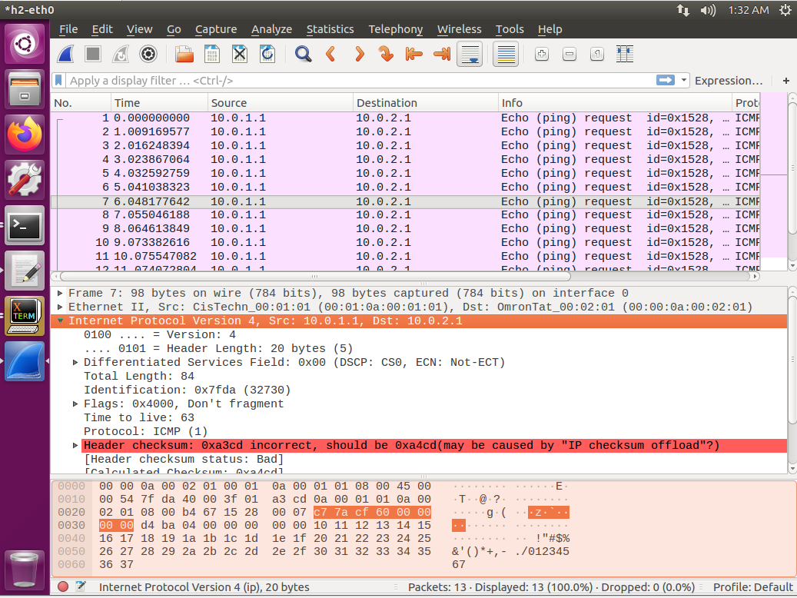

# P4(2)

[toc]

## 實驗一
為Mac Layer Forwarding

### 實驗環境


### 程式碼內容

* p4app.json

```sh
{

  "program": "basic.p4",

  "switch": "simple_switch",

  "compiler": "p4c",

  "options": "--target bmv2 --arch v1model --std p4-16",

  "switch_cli": "simple_switch_CLI",

  "cli": true,

  "pcap_dump": true,

  "enable_log": true,

  "topo_module": {

    "file_path": "",

    "module_name": "p4utils.mininetlib.apptopo",

    "object_name": "AppTopoStrategies"

  },

  "controller_module": null,

  "topodb_module": {

    "file_path": "",

    "module_name": "p4utils.utils.topology",

    "object_name": "Topology"

  },

  "mininet_module": {

    "file_path": "",

    "module_name": "p4utils.mininetlib.p4net",

    "object_name": "P4Mininet"

  },

  "topology": {

    "links": [["h1", "s1"], ["h2", "s1"]],

    "hosts": {

      "h1": {

      },

      "h2": {

      }

    },

    "switches": {

      "s1": {

        "cli_input": "cmd.txt",

        "program": "basic.p4"

      }

    }

  }

}
```

* basic.p4
> Mac Layer封包格式
> 

```sh
/* -*- P4_16 -*- */
#include <core.p4>
#include <v1model.p4>

/*************************************************************************
*********************** H E A D E R S  ***********************************
*************************************************************************/

header ethernet_t {
    bit<48> dstAddr;
    bit<48> srcAddr;
    bit<16>   etherType;
}

 
struct metadata {
    /* empty */
}

 

struct headers {
  ethernet_t   ethernet;
}

 

/*************************************************************************
*********************** P A R S E R  ***********************************
*************************************************************************/

parser MyParser(packet_in packet,
                out headers hdr,
                inout metadata meta,
                inout standard_metadata_t standard_metadata) {

    state start {
         transition parse_ethernet;
    }

     state parse_ethernet {
        packet.extract(hdr.ethernet);
        transition accept;
     }	
}

 

/*************************************************************************

************   C H E C K S U M    V E R I F I C A T I O N   *************

*************************************************************************/

 

control MyVerifyChecksum(inout headers hdr, inout metadata meta) {  
    apply {  }
}

/*************************************************************************
**************  I N G R E S S   P R O C E S S I N G   *******************
*************************************************************************/
control MyIngress(inout headers hdr,
                  inout metadata meta,
                  inout standard_metadata_t standard_metadata) {
    action drop() {
        mark_to_drop(standard_metadata);
    }

    action forward(bit<9> port) {
        standard_metadata.egress_spec = port;
    }

    table mac_forward {
        key = {
            hdr.ethernet.dstAddr: exact;
        }

        actions = {
            forward;
            drop;
        }
        size = 1024;
        default_action = drop();
    }

    apply {
        mac_forward.apply();
    }
}

/*************************************************************************
****************  E G R E S S   P R O C E S S I N G   *******************
*************************************************************************/

control MyEgress(inout headers hdr,
                 inout metadata meta,
                 inout standard_metadata_t standard_metadata) {
    apply {  }
}

/*************************************************************************
*************   C H E C K S U M    C O M P U T A T I O N   **************
*************************************************************************/

control MyComputeChecksum(inout headers  hdr, inout metadata meta) {
     apply {
    }
}

/*************************************************************************
***********************  D E P A R S E R  *******************************
*************************************************************************/

control MyDeparser(packet_out packet, in headers hdr) {
    apply {
      packet.emit(hdr.ethernet);
    }
}

/*************************************************************************
***********************  S W I T C H  *******************************
*************************************************************************/

V1Switch(
MyParser(),
MyVerifyChecksum(),
MyIngress(),
MyEgress(),
MyComputeChecksum(),
MyDeparser()

) main;
```

* cmd.txt

```sh
table_add mac_forward forward 00:00:0a:00:01:01 => 1
table_add mac_forward forward 00:00:0a:00:01:02 => 2
```
### 實驗結果

* 查看arp
  * h1
  
    
    
  * h2
  
    

* `h1 ping h2`
  
  

## 實驗二

為Network Layer Forwarding

### 實驗環境


### 程式碼內容

* ip_forwarding.p4
  
```sh
#include <core.p4>

#include <v1model.p4>

typedef bit<48> macAddr_t;

typedef bit<9> egressSpec_t;

 

header arp_t {

    bit<16> htype;

    bit<16> ptype;

    bit<8>  hlen;

    bit<8>  plen;

    bit<16> opcode;

    bit<48> hwSrcAddr;

    bit<32> protoSrcAddr;

    bit<48> hwDstAddr;

    bit<32> protoDstAddr;

}

 

header ethernet_t {

    bit<48> dstAddr;

    bit<48> srcAddr;

    bit<16> etherType;

}

 

header ipv4_t {

    bit<4>  version;

    bit<4>  ihl;

    bit<8>  diffserv;

    bit<16> totalLen;

    bit<16> identification;

    bit<3>  flags;

    bit<13> fragOffset;

    bit<8>  ttl;

    bit<8>  protocol;

    bit<16> hdrChecksum;

    bit<32> srcAddr;

    bit<32> dstAddr;

}

 

struct metadata {

}

 

struct headers {

    @name(".arp")

    arp_t      arp;

    @name(".ethernet")

    ethernet_t ethernet;

    @name(".ipv4")

    ipv4_t     ipv4;

}

 

parser ParserImpl(packet_in packet, out headers hdr, inout metadata meta, inout standard_metadata_t standard_metadata) {

    @name(".parse_arp") state parse_arp {

        packet.extract(hdr.arp);

        transition accept;

    }

    @name(".parse_ethernet") state parse_ethernet {

        packet.extract(hdr.ethernet);

        transition select(hdr.ethernet.etherType) {

            16w0x800: parse_ipv4;

            16w0x806: parse_arp;

            default: accept;

        }

    }

    @name(".parse_ipv4") state parse_ipv4 {

        packet.extract(hdr.ipv4);

        transition accept;

    }

    @name(".start") state start {

        transition parse_ethernet;

    }

}

 

control egress(inout headers hdr, inout metadata meta, inout standard_metadata_t standard_metadata) {

    apply {

    }

}

 

control ingress(inout headers hdr, inout metadata meta, inout standard_metadata_t standard_metadata) {

    @name(".set_nhop") action set_nhop(macAddr_t dstAddr, egressSpec_t port) {

        //set the src mac address as the previous dst, this is not correct right?

        hdr.ethernet.srcAddr = hdr.ethernet.dstAddr;

 

        //set the destination mac address that we got from the match in the table

        hdr.ethernet.dstAddr = dstAddr;

 

        //set the output port that we also get from the table

        standard_metadata.egress_spec = port;

 

        //decrease ttl by 1

        hdr.ipv4.ttl = hdr.ipv4.ttl - 1;

    }

    @name("._drop") action _drop() {

        mark_to_drop(standard_metadata);

    }

    @name(".ipv4_lpm") table ipv4_lpm {

        actions = {

            set_nhop;

            _drop;

        }

        key = {

            hdr.ipv4.dstAddr: lpm;

        }

        size = 512;

        const default_action = _drop();

    }

    apply {

        ipv4_lpm.apply();

    }

}

 

control DeparserImpl(packet_out packet, in headers hdr) {

    apply {

        packet.emit(hdr.ethernet);

        packet.emit(hdr.arp);

        packet.emit(hdr.ipv4);

    }

}

 

control verifyChecksum(inout headers hdr, inout metadata meta) {

    apply {

        verify_checksum(true, { hdr.ipv4.version, hdr.ipv4.ihl, hdr.ipv4.diffserv, hdr.ipv4.totalLen, hdr.ipv4.identification, hdr.ipv4.flags, hdr.ipv4.fragOffset, hdr.ipv4.ttl, hdr.ipv4.protocol, hdr.ipv4.srcAddr, hdr.ipv4.dstAddr }, hdr.ipv4.hdrChecksum, HashAlgorithm.csum16);

    }

}

 

control computeChecksum(inout headers hdr, inout metadata meta) {

    apply {
        # 如果將這裡清空，目的端可以收到封包，但無法進行傳送
        update_checksum(true, { hdr.ipv4.version, hdr.ipv4.ihl, hdr.ipv4.diffserv, hdr.ipv4.totalLen, hdr.ipv4.identification, hdr.ipv4.flags, hdr.ipv4.fragOffset, hdr.ipv4.ttl, hdr.ipv4.protocol, hdr.ipv4.srcAddr, hdr.ipv4.dstAddr }, hdr.ipv4.hdrChecksum, HashAlgorithm.csum16);

    }

}

 

V1Switch(ParserImpl(), verifyChecksum(), ingress(), egress(), computeChecksum(), DeparserImpl()) main;
```

* p4app.json
  
```sh
{

  "program": "ip_forward.p4",

  "switch": "simple_switch",

  "compiler": "p4c",

  "options": "--target bmv2 --arch v1model --std p4-16",

  "switch_cli": "simple_switch_CLI",

  "cli": true,

  "pcap_dump": true,

  "enable_log": true,

  "topo_module": {

    "file_path": "",

    "module_name": "p4utils.mininetlib.apptopo",

    "object_name": "AppTopoStrategies"

  },

  "controller_module": null,

  "topodb_module": {

    "file_path": "",

    "module_name": "p4utils.utils.topology",

    "object_name": "Topology"

  },

  "mininet_module": {

    "file_path": "",

    "module_name": "p4utils.mininetlib.p4net",

    "object_name": "P4Mininet"

  },

  "topology": {

    "assignment_strategy": "manual",

    "auto_arp_tables": "true",

    "auto_gw_arp": "true",

    "links": [["h1", "s1"], ["h2", "s1"]],

    "hosts": {

      "h1": {

        "ip": "10.0.1.1/24",

        "gw": "10.0.1.254"

      },

      "h2": {

        "ip": "10.0.2.1/24",

       "gw": "10.0.2.254"

      }

    },

    "switches": {

      "s1": {

        "cli_input": "cmd.txt",

        "program": "ip_forward.p4"

      }

    }

  }

}
```

* cmd.txt
  
```sh
table_add ipv4_lpm set_nhop 10.0.1.1/32 => 00:00:0a:00:01:01 1

table_add ipv4_lpm set_nhop 10.0.2.1/32 => 00:00:0a:00:02:01 2
```

### 實驗結果

* 未將**computeChecksum**清空
  
  

* 將**computeChecksum**清空
    >在h2打開wireshark，可以看到checksum發生錯誤，導致無法傳送reply封包

  

---
# 作業

## 作業一  

做Mac Layer Forwarding

### 作業環境


### 程式碼內容

* p4app.json
  
```sh
{
  "program": "basic.p4",
  "switch": "simple_switch",
  "compiler": "p4c",
  "options": "--target bmv2 --arch v1model --std p4-16",
  "switch_cli": "simple_switch_CLI",
  "cli": true,
  "pcap_dump": true,
  "enable_log": true,
  "topo_module": {
    "file_path": "",
    "module_name": "p4utils.mininetlib.apptopo",
    "object_name": "AppTopoStrategies"
  },
  "controller_module": null,
  "topodb_module": {
    "file_path": "",
    "module_name": "p4utils.utils.topology",
    "object_name": "Topology"
  },
  "mininet_module": {
    "file_path": "",
    "module_name": "p4utils.mininetlib.p4net",
    "object_name": "P4Mininet"
  },
  "topology": {
    "assignment_strategy": "l2",
    "links": [["h1", "s1"], ["s1", "s2"], ["s2", "h2"], ["s2", "s3"], ["s3", "h3"]],
    "hosts": {
      "h1": {
      },
      "h2": {
      },
      "h3": {
      }
    },
    "switches": {
      "s1": {
        "cli_input": "cmd1.txt",
        "program": "basic.p4"
      },
      "s2": {
        "cli_input": "cmd2.txt",
        "program": "basic.p4"
      },
      "s3": {
        "cli_input": "cmd3.txt",
        "program": "basic.p4"
      }
    }
  }
}
```

* basic.p4

```sh
/* -*- P4_16 -*- */
#include <core.p4>
#include <v1model.p4>

/*************************************************************************
*********************** H E A D E R S  ***********************************
*************************************************************************/

header ethernet_t {
    bit<48> dstAddr;
    bit<48> srcAddr;
    bit<16>   etherType;
}

 
struct metadata {
    /* empty */
}

 

struct headers {
  ethernet_t   ethernet;
}

 

/*************************************************************************
*********************** P A R S E R  ***********************************
*************************************************************************/

parser MyParser(packet_in packet,
                out headers hdr,
                inout metadata meta,
                inout standard_metadata_t standard_metadata) {

    state start {
         transition parse_ethernet;
    }

     state parse_ethernet {
        packet.extract(hdr.ethernet);
        transition accept;
     }	
}

 

/*************************************************************************

************   C H E C K S U M    V E R I F I C A T I O N   *************

*************************************************************************/

 

control MyVerifyChecksum(inout headers hdr, inout metadata meta) {  
    apply {  }
}

/*************************************************************************
**************  I N G R E S S   P R O C E S S I N G   *******************
*************************************************************************/
control MyIngress(inout headers hdr,
                  inout metadata meta,
                  inout standard_metadata_t standard_metadata) {
    action drop() {
        mark_to_drop(standard_metadata);
    }

    action forward(bit<9> port) {
        standard_metadata.egress_spec = port;
    }

    table mac_forward {
        key = {
            hdr.ethernet.dstAddr: exact;
        }

        actions = {
            forward;
            drop;
        }
        size = 1024;
        default_action = drop();
    }

    apply {
        mac_forward.apply();
    }
}

/*************************************************************************
****************  E G R E S S   P R O C E S S I N G   *******************
*************************************************************************/

control MyEgress(inout headers hdr,
                 inout metadata meta,
                 inout standard_metadata_t standard_metadata) {
    apply {  }
}

/*************************************************************************
*************   C H E C K S U M    C O M P U T A T I O N   **************
*************************************************************************/

control MyComputeChecksum(inout headers  hdr, inout metadata meta) {
     apply {
    }
}

/*************************************************************************
***********************  D E P A R S E R  *******************************
*************************************************************************/

control MyDeparser(packet_out packet, in headers hdr) {
    apply {
      packet.emit(hdr.ethernet);
    }
}

/*************************************************************************
***********************  S W I T C H  *******************************
*************************************************************************/

V1Switch(
MyParser(),
MyVerifyChecksum(),
MyIngress(),
MyEgress(),
MyComputeChecksum(),
MyDeparser()

) main;
```

* cmd1.txt

```sh
table_add mac_forward forward 00:00:0a:00:00:01 => 1
table_add mac_forward forward 00:00:0a:00:00:02 => 2
table_add mac_forward forward 00:00:0a:00:00:03 => 2
```

* cmd2.txt
  
```sh
table_add mac_forward forward 00:00:0a:00:00:01 => 1
table_add mac_forward forward 00:00:0a:00:00:02 => 2
table_add mac_forward forward 00:00:0a:00:00:03 => 3
```

* cmd3.txt

```sh
table_add mac_forward forward 00:00:0a:00:00:01 => 1
table_add mac_forward forward 00:00:0a:00:00:02 => 1
table_add mac_forward forward 00:00:0a:00:00:03 => 2
```

### 作業結果


## 作業二

延續上個作業，但做**Network Layer Forwarding**

### 作業環境


### 程式碼內容

* p4app.json

```sh
{

  "program": "ip_forward.p4",

  "switch": "simple_switch",

  "compiler": "p4c",

  "options": "--target bmv2 --arch v1model --std p4-16",

  "switch_cli": "simple_switch_CLI",

  "cli": true,

  "pcap_dump": true,

  "enable_log": true,

  "topo_module": {

    "file_path": "",

    "module_name": "p4utils.mininetlib.apptopo",

    "object_name": "AppTopoStrategies"

  },

  "controller_module": null,

  "topodb_module": {

    "file_path": "",

    "module_name": "p4utils.utils.topology",

    "object_name": "Topology"

  },

  "mininet_module": {

    "file_path": "",

    "module_name": "p4utils.mininetlib.p4net",

    "object_name": "P4Mininet"

  },

  "topology": {

    "assignment_strategy": "l3",

    "auto_arp_tables": "true",

    "auto_gw_arp": "true",

    "links": [["h1", "s1"], ["s1", "s2"], ["s2", "h2"], ["s2", "s3"], ["s3", "h3"] ],

    "hosts": {

      "h1": {
      },

      "h2": {
      },

      "h3": {
      }

    },

    "switches": {

      "s1": {

        "cli_input": "cmd1.txt",

        "program": "ip_forward.p4"

      },

      "s2": {

        "cli_input": "cmd2.txt",

        "program": "ip_forward.p4"

      },

      "s3": {

        "cli_input": "cmd3.txt",

        "program": "ip_forward.p4"

      }

    }

  }

}
```

* ip_forward.p4

```sh
#include <core.p4>

#include <v1model.p4>

typedef bit<48> macAddr_t;

typedef bit<9> egressSpec_t;

 

header arp_t {

    bit<16> htype;

    bit<16> ptype;

    bit<8>  hlen;

    bit<8>  plen;

    bit<16> opcode;

    bit<48> hwSrcAddr;

    bit<32> protoSrcAddr;

    bit<48> hwDstAddr;

    bit<32> protoDstAddr;

}

 

header ethernet_t {

    bit<48> dstAddr;

    bit<48> srcAddr;

    bit<16> etherType;

}

 

header ipv4_t {

    bit<4>  version;

    bit<4>  ihl;

    bit<8>  diffserv;

    bit<16> totalLen;

    bit<16> identification;

    bit<3>  flags;

    bit<13> fragOffset;

    bit<8>  ttl;

    bit<8>  protocol;

    bit<16> hdrChecksum;

    bit<32> srcAddr;

    bit<32> dstAddr;

}

 

struct metadata {

}

 

struct headers {

    @name(".arp")

    arp_t      arp;

    @name(".ethernet")

    ethernet_t ethernet;

    @name(".ipv4")

    ipv4_t     ipv4;

}

 

parser ParserImpl(packet_in packet, out headers hdr, inout metadata meta, inout standard_metadata_t standard_metadata) {

    @name(".parse_arp") state parse_arp {

        packet.extract(hdr.arp);

        transition accept;

    }

    @name(".parse_ethernet") state parse_ethernet {

        packet.extract(hdr.ethernet);

        transition select(hdr.ethernet.etherType) {

            16w0x800: parse_ipv4;

            16w0x806: parse_arp;

            default: accept;

        }

    }

    @name(".parse_ipv4") state parse_ipv4 {

        packet.extract(hdr.ipv4);

        transition accept;

    }

    @name(".start") state start {

        transition parse_ethernet;

    }

}

 

control egress(inout headers hdr, inout metadata meta, inout standard_metadata_t standard_metadata) {

    apply {

    }

}

 

control ingress(inout headers hdr, inout metadata meta, inout standard_metadata_t standard_metadata) {

    @name(".set_nhop") action set_nhop(macAddr_t dstAddr, egressSpec_t port) {

        //set the src mac address as the previous dst, this is not correct right?

        hdr.ethernet.srcAddr = hdr.ethernet.dstAddr;

 

        //set the destination mac address that we got from the match in the table

        hdr.ethernet.dstAddr = dstAddr;

 

        //set the output port that we also get from the table

        standard_metadata.egress_spec = port;

 

        //decrease ttl by 1

        hdr.ipv4.ttl = hdr.ipv4.ttl - 1;

    }

    @name("._drop") action _drop() {

        mark_to_drop(standard_metadata);

    }

    @name(".ipv4_lpm") table ipv4_lpm {

        actions = {

            set_nhop;

            _drop;

        }

        key = {

            hdr.ipv4.dstAddr: lpm;

        }

        size = 512;

        const default_action = _drop();

    }

    apply {

        ipv4_lpm.apply();

    }

}

 

control DeparserImpl(packet_out packet, in headers hdr) {

    apply {

        packet.emit(hdr.ethernet);

        packet.emit(hdr.arp);

        packet.emit(hdr.ipv4);

    }

}

 

control verifyChecksum(inout headers hdr, inout metadata meta) {

    apply {

        verify_checksum(true, { hdr.ipv4.version, hdr.ipv4.ihl, hdr.ipv4.diffserv, hdr.ipv4.totalLen, hdr.ipv4.identification, hdr.ipv4.flags, hdr.ipv4.fragOffset, hdr.ipv4.ttl, hdr.ipv4.protocol, hdr.ipv4.srcAddr, hdr.ipv4.dstAddr }, hdr.ipv4.hdrChecksum, HashAlgorithm.csum16);

    }

}

 

control computeChecksum(inout headers hdr, inout metadata meta) {

    apply {

        update_checksum(true, { hdr.ipv4.version, hdr.ipv4.ihl, hdr.ipv4.diffserv, hdr.ipv4.totalLen, hdr.ipv4.identification, hdr.ipv4.flags, hdr.ipv4.fragOffset, hdr.ipv4.ttl, hdr.ipv4.protocol, hdr.ipv4.srcAddr, hdr.ipv4.dstAddr }, hdr.ipv4.hdrChecksum, HashAlgorithm.csum16);

    }

}

 

V1Switch(ParserImpl(), verifyChecksum(), ingress(), egress(), computeChecksum(), DeparserImpl()) main;
```

* cmd1.txt

```sh
table_add ipv4_lpm set_nhop 10.1.1.2/32 => 00:00:0a:01:01:02 1
table_add ipv4_lpm set_nhop 10.2.2.2/32 => 00:00:0a:02:02:02 2
table_add ipv4_lpm set_nhop 10.3.3.2/32 => 00:00:0a:03:03:02 2
```

* cmd2.txt

```sh
table_add ipv4_lpm set_nhop 10.1.1.2/32 => 00:00:0a:01:01:02 1
table_add ipv4_lpm set_nhop 10.2.2.2/32 => 00:00:0a:02:02:02 2
table_add ipv4_lpm set_nhop 10.3.3.2/32 => 00:00:0a:03:03:02 3
```

* cmd3.txt

```sh
table_add ipv4_lpm set_nhop 10.1.1.2/32 => 00:00:0a:01:01:02 1
table_add ipv4_lpm set_nhop 10.2.2.2/32 => 00:00:0a:02:02:02 1
table_add ipv4_lpm set_nhop 10.3.3.2/32 => 00:00:0a:03:03:02 2
```

### 作業結果


## 作業三

做**Network Layer Forwarding**

### 作業環境


### 程式碼內容

* p4app.json

```sh
{
  "program": "ip_forward.p4",
  "switch": "simple_switch",
  "compiler": "p4c",
  "options": "--target bmv2 --arch v1model --std p4-16",
  "switch_cli": "simple_switch_CLI",
  "cli": true,
  "pcap_dump": true,
  "enable_log": true,
  "topo_module": {
    "file_path": "",
    "module_name": "p4utils.mininetlib.apptopo",
    "object_name": "AppTopoStrategies"
  },
  "controller_module": null,
  "topodb_module": {
    "file_path": "",
    "module_name": "p4utils.utils.topology",
    "object_name": "Topology"
  },
  "mininet_module": {
    "file_path": "",
    "module_name": "p4utils.mininetlib.p4net",
    "object_name": "P4Mininet"
  },
  "topology": {
    "assignment_strategy": "mixed",
    "auto_arp_tables": "true",
    "auto_gw_arp": "true",
    "links": [["h1", "s1"], ["s1", "s2"], ["s2", "s3"], ["s3", "h2"], ["s3", "h3"]],
    "hosts": {
      "h1": {
        
      },
      "h2": {
        
      },
      "h3": {
	
      }
    },
    "switches": {
      "s1": {
        "cli_input": "cmd1.txt",
        "program": "ip_forward.p4"
      },
      "s2": {
        "cli_input": "cmd2.txt",
        "program": "ip_forward.p4"
      },
      "s3": {
        "cli_input": "cmd3.txt",
        "program": "ip_forward.p4"
      }
    }
  }
}
```

* ip_forward.p4

```sh
#include <core.p4>

#include <v1model.p4>

typedef bit<48> macAddr_t;

typedef bit<9> egressSpec_t;

 

header arp_t {

    bit<16> htype;

    bit<16> ptype;

    bit<8>  hlen;

    bit<8>  plen;

    bit<16> opcode;

    bit<48> hwSrcAddr;

    bit<32> protoSrcAddr;

    bit<48> hwDstAddr;

    bit<32> protoDstAddr;

}

 

header ethernet_t {

    bit<48> dstAddr;

    bit<48> srcAddr;

    bit<16> etherType;

}

 

header ipv4_t {

    bit<4>  version;

    bit<4>  ihl;

    bit<8>  diffserv;

    bit<16> totalLen;

    bit<16> identification;

    bit<3>  flags;

    bit<13> fragOffset;

    bit<8>  ttl;

    bit<8>  protocol;

    bit<16> hdrChecksum;

    bit<32> srcAddr;

    bit<32> dstAddr;

}

 

struct metadata {

}

 

struct headers {

    @name(".arp")

    arp_t      arp;

    @name(".ethernet")

    ethernet_t ethernet;

    @name(".ipv4")

    ipv4_t     ipv4;

}

 

parser ParserImpl(packet_in packet, out headers hdr, inout metadata meta, inout standard_metadata_t standard_metadata) {

    @name(".parse_arp") state parse_arp {

        packet.extract(hdr.arp);

        transition accept;

    }

    @name(".parse_ethernet") state parse_ethernet {

        packet.extract(hdr.ethernet);

        transition select(hdr.ethernet.etherType) {

            16w0x800: parse_ipv4;

            16w0x806: parse_arp;

            default: accept;

        }

    }

    @name(".parse_ipv4") state parse_ipv4 {

        packet.extract(hdr.ipv4);

        transition accept;

    }

    @name(".start") state start {

        transition parse_ethernet;

    }

}

 

control egress(inout headers hdr, inout metadata meta, inout standard_metadata_t standard_metadata) {

    apply {

    }

}

 

control ingress(inout headers hdr, inout metadata meta, inout standard_metadata_t standard_metadata) {

    @name(".set_nhop") action set_nhop(macAddr_t dstAddr, egressSpec_t port) {

        //set the src mac address as the previous dst, this is not correct right?

        hdr.ethernet.srcAddr = hdr.ethernet.dstAddr;

 

        //set the destination mac address that we got from the match in the table

        hdr.ethernet.dstAddr = dstAddr;

 

        //set the output port that we also get from the table

        standard_metadata.egress_spec = port;

 

        //decrease ttl by 1

        hdr.ipv4.ttl = hdr.ipv4.ttl - 1;

    }

    @name("._drop") action _drop() {

        mark_to_drop(standard_metadata);

    }

    @name(".ipv4_lpm") table ipv4_lpm {

        actions = {

            set_nhop;

            _drop;

        }

        key = {

            hdr.ipv4.dstAddr: lpm;

        }

        size = 512;

        const default_action = _drop();

    }

    apply {

        ipv4_lpm.apply();

    }

}

 

control DeparserImpl(packet_out packet, in headers hdr) {

    apply {

        packet.emit(hdr.ethernet);

        packet.emit(hdr.arp);

        packet.emit(hdr.ipv4);

    }

}

 

control verifyChecksum(inout headers hdr, inout metadata meta) {

    apply {

        verify_checksum(true, { hdr.ipv4.version, hdr.ipv4.ihl, hdr.ipv4.diffserv, hdr.ipv4.totalLen, hdr.ipv4.identification, hdr.ipv4.flags, hdr.ipv4.fragOffset, hdr.ipv4.ttl, hdr.ipv4.protocol, hdr.ipv4.srcAddr, hdr.ipv4.dstAddr }, hdr.ipv4.hdrChecksum, HashAlgorithm.csum16);

    }

}

 

control computeChecksum(inout headers hdr, inout metadata meta) {

    apply {

        update_checksum(true, { hdr.ipv4.version, hdr.ipv4.ihl, hdr.ipv4.diffserv, hdr.ipv4.totalLen, hdr.ipv4.identification, hdr.ipv4.flags, hdr.ipv4.fragOffset, hdr.ipv4.ttl, hdr.ipv4.protocol, hdr.ipv4.srcAddr, hdr.ipv4.dstAddr }, hdr.ipv4.hdrChecksum, HashAlgorithm.csum16);

    }

}

 

V1Switch(ParserImpl(), verifyChecksum(), ingress(), egress(), computeChecksum(), DeparserImpl()) main;
```

* cmd1.txt

```sh
table_add ipv4_lpm set_nhop 10.0.1.1/32 => 00:00:0a:00:01:01 1
table_add ipv4_lpm set_nhop 10.0.3.0/24 => 00:00:0a:00:03:00 2
```

* cmd2.txt

```sh
table_add ipv4_lpm set_nhop 10.0.1.1/32 => 00:00:0a:00:01:01 1
table_add ipv4_lpm set_nhop 10.0.3.0/24 => 00:00:0a:00:02:00 2
```

* cmd3.txt

```sh
table_add ipv4_lpm set_nhop 10.0.1.1/32 => 00:00:0a:00:01:01 1
table_add ipv4_lpm set_nhop 10.0.3.2/32 => 00:00:0a:00:03:02 2
table_add ipv4_lpm set_nhop 10.0.3.3/32 => 00:00:0a:00:03:03 3
```
### 實驗結果

