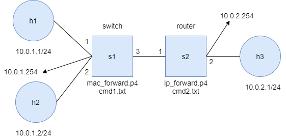
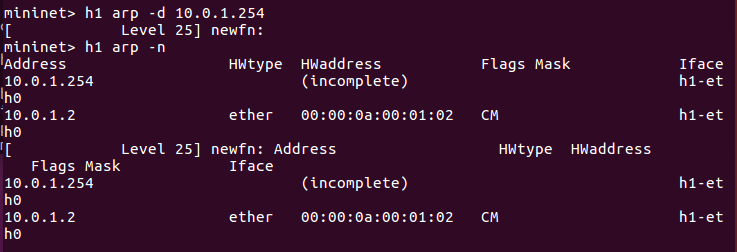
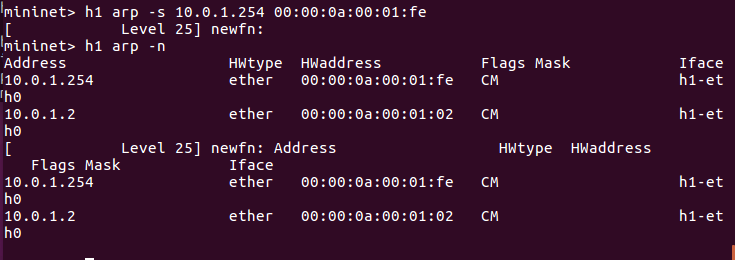
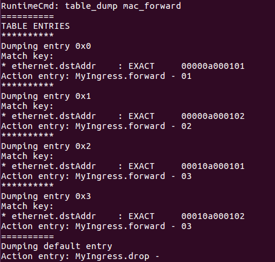
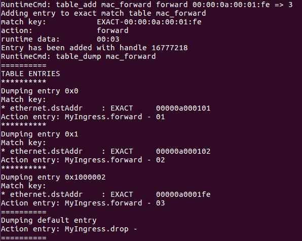
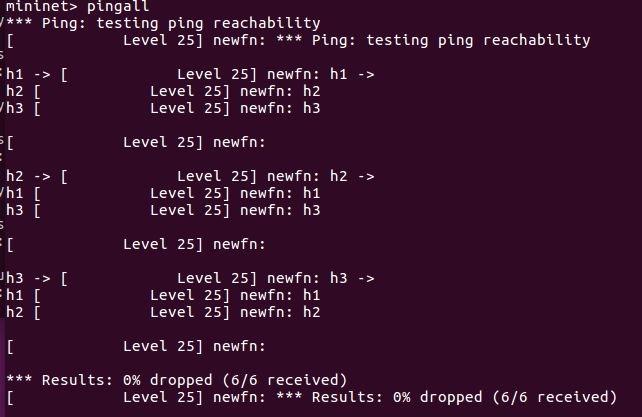
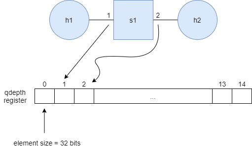
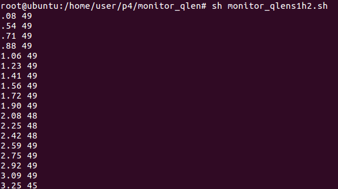
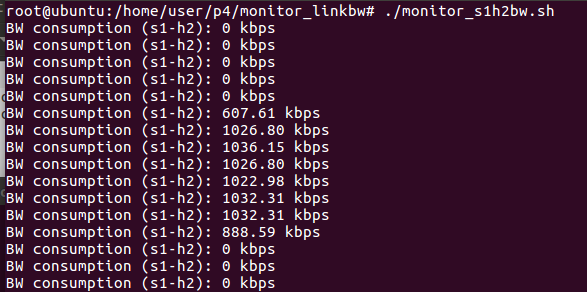
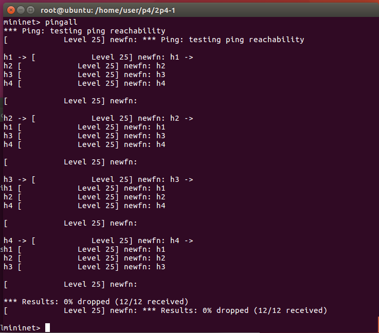

# P4(3)

[toc]

## 實驗一

在程式執行下，手動新增、刪除規則

### 實驗環境



### 程式碼內容

* p4app.json

```sh
{
  "program": "ip_forward.p4",
  "switch": "simple_switch",
  "compiler": "p4c",
  "options": "--target bmv2 --arch v1model --std p4-16",
  "switch_cli": "simple_switch_CLI",
  "cli": true,
  "pcap_dump": false,
  "enable_log": true,
  "topo_module": {
    "file_path": "",
    "module_name": "p4utils.mininetlib.apptopo",
    "object_name": "AppTopoStrategies"
  },
  "controller_module": null,
  "topodb_module": {
    "file_path": "",
    "module_name": "p4utils.utils.topology",
    "object_name": "Topology"
  },
  "mininet_module": {
    "file_path": "",
    "module_name": "p4utils.mininetlib.p4net",
    "object_name": "P4Mininet"
  },
  "topology": {
    "assignment_strategy": "manual",
    "auto_arp_tables": "true",
    "auto_gw_arp": "true",
    "links": [["h1", "s1"], ["h2", "s1"], ["s1", "s2"], ["s2", "h3"]],
    "hosts": {
      "h1": {
        "ip": "10.0.1.1/24",
        "gw": "10.0.1.254"
      },
      "h2": {
        "ip": "10.0.1.2/24",
        "gw": "10.0.1.254"
      },
      "h3": {
        "ip": "10.0.2.1/24",
        "gw": "10.0.2.254"
      } 
    },
    "switches": {
      "s1": {
        "cli_input": "cmd1.txt",
        "program": "mac_forward.p4"
      },
      "s2": {
        "cli_input": "cmd2.txt",
        "program": "ip_forward.p4"
      }
    }
  }
}
```

* mac_forward.p4

```sh
/* -*- P4_16 -*- */
#include <core.p4>
#include <v1model.p4>

/*************************************************************************
*********************** H E A D E R S  ***********************************
*************************************************************************/

header ethernet_t {
    bit<48> dstAddr;
    bit<48> srcAddr;
    bit<16>   etherType;
}

 
struct metadata {
    /* empty */
}

 

struct headers {
  ethernet_t   ethernet;
}

 

/*************************************************************************
*********************** P A R S E R  ***********************************
*************************************************************************/

parser MyParser(packet_in packet,
                out headers hdr,
                inout metadata meta,
                inout standard_metadata_t standard_metadata) {

    state start {
         transition parse_ethernet;
    }

     state parse_ethernet {
        packet.extract(hdr.ethernet);
        transition accept;
     }	
}

 

/*************************************************************************

************   C H E C K S U M    V E R I F I C A T I O N   *************

*************************************************************************/

 

control MyVerifyChecksum(inout headers hdr, inout metadata meta) {  
    apply {  }
}

/*************************************************************************
**************  I N G R E S S   P R O C E S S I N G   *******************
*************************************************************************/
control MyIngress(inout headers hdr,
                  inout metadata meta,
                  inout standard_metadata_t standard_metadata) {
    action drop() {
        mark_to_drop(standard_metadata);
    }

    action forward(bit<9> port) {
        standard_metadata.egress_spec = port;
    }

    table mac_forward {
        key = {
            hdr.ethernet.dstAddr: exact;
        }

        actions = {
            forward;
            drop;
        }
        size = 1024;
        default_action = drop();
    }

    apply {
        mac_forward.apply();
    }
}

/*************************************************************************
****************  E G R E S S   P R O C E S S I N G   *******************
*************************************************************************/

control MyEgress(inout headers hdr,
                 inout metadata meta,
                 inout standard_metadata_t standard_metadata) {
    apply {  }
}

/*************************************************************************
*************   C H E C K S U M    C O M P U T A T I O N   **************
*************************************************************************/

control MyComputeChecksum(inout headers  hdr, inout metadata meta) {
     apply {
    }
}

/*************************************************************************
***********************  D E P A R S E R  *******************************
*************************************************************************/

control MyDeparser(packet_out packet, in headers hdr) {
    apply {
      packet.emit(hdr.ethernet);
    }
}

/*************************************************************************
***********************  S W I T C H  *******************************
*************************************************************************/

V1Switch(
MyParser(),
MyVerifyChecksum(),
MyIngress(),
MyEgress(),
MyComputeChecksum(),
MyDeparser()

) main;
```

* ip_forward.p4

```sh
#include <core.p4>
#include <v1model.p4>
typedef bit<48> macAddr_t;
typedef bit<9> egressSpec_t;
  
header ethernet_t {
    bit<48> dstAddr;
    bit<48> srcAddr;
    bit<16> etherType;
}
 
header ipv4_t {
    bit<4>  version;
    bit<4>  ihl;
    bit<8>  diffserv;
    bit<16> totalLen;
    bit<16> identification;
    bit<3>  flags;
    bit<13> fragOffset;
    bit<8>  ttl;
    bit<8>  protocol;
    bit<16> hdrChecksum;
    bit<32> srcAddr;
    bit<32> dstAddr;
}
 
struct metadata {
}
 
struct headers {
    @name(".ethernet")
    ethernet_t ethernet;
    @name(".ipv4")
    ipv4_t     ipv4;
}
 
parser ParserImpl(packet_in packet, out headers hdr, inout metadata meta, inout standard_metadata_t standard_metadata) {

    @name(".parse_ethernet") state parse_ethernet {
        packet.extract(hdr.ethernet);
        transition select(hdr.ethernet.etherType) {
            16w0x800: parse_ipv4;
            default: accept;
        }
    }
    @name(".parse_ipv4") state parse_ipv4 {
        packet.extract(hdr.ipv4);
        transition accept;
    }
    @name(".start") state start {
        transition parse_ethernet;
    }
}
 
control egress(inout headers hdr, inout metadata meta, inout standard_metadata_t standard_metadata) {
    apply {
    }
}
 
control ingress(inout headers hdr, inout metadata meta, inout standard_metadata_t standard_metadata) {
    @name(".set_nhop") action set_nhop(macAddr_t dstAddr, egressSpec_t port) {
        //set the src mac address as the previous dst, this is not correct right?
        hdr.ethernet.srcAddr = hdr.ethernet.dstAddr;
 
        //set the destination mac address that we got from the match in the table
        hdr.ethernet.dstAddr = dstAddr;
 
        //set the output port that we also get from the table
        standard_metadata.egress_spec = port;
 
        //decrease ttl by 1
        hdr.ipv4.ttl = hdr.ipv4.ttl - 1;
    }
    @name("._drop") action _drop() {
        mark_to_drop(standard_metadata);
    }
    @name(".ipv4_lpm") table ipv4_lpm {
        actions = {
            set_nhop;
            _drop;
        }
        key = {
            hdr.ipv4.dstAddr: lpm;
        }
        size = 512;
        const default_action = _drop();
    }
    apply {
        ipv4_lpm.apply();
    }
}
 
control DeparserImpl(packet_out packet, in headers hdr) {
    apply {
        packet.emit(hdr.ethernet);
        packet.emit(hdr.ipv4);
    }
}
 
control verifyChecksum(inout headers hdr, inout metadata meta) {
    apply {
        verify_checksum(true, { hdr.ipv4.version, hdr.ipv4.ihl, hdr.ipv4.diffserv, hdr.ipv4.totalLen, hdr.ipv4.identification, hdr.ipv4.flags, hdr.ipv4.fragOffset, hdr.ipv4.ttl, hdr.ipv4.protocol, hdr.ipv4.srcAddr, hdr.ipv4.dstAddr }, hdr.ipv4.hdrChecksum, HashAlgorithm.csum16);
    }
}
 
control computeChecksum(inout headers hdr, inout metadata meta) {
    apply {
        update_checksum(true, { hdr.ipv4.version, hdr.ipv4.ihl, hdr.ipv4.diffserv, hdr.ipv4.totalLen, hdr.ipv4.identification, hdr.ipv4.flags, hdr.ipv4.fragOffset, hdr.ipv4.ttl, hdr.ipv4.protocol, hdr.ipv4.srcAddr, hdr.ipv4.dstAddr }, hdr.ipv4.hdrChecksum, HashAlgorithm.csum16);
    }
}
 
V1Switch(ParserImpl(), verifyChecksum(), ingress(), egress(), computeChecksum(), DeparserImpl()) main;
```

* cmd1.txt


```sh
table_add mac_forward forward 00:00:0a:00:01:01 => 1
table_add mac_forward forward 00:00:0a:00:01:02 => 2

# 由於h1與h2對10.0.1.254的mac address不同，所以要設定不同的規則
table_add mac_forward forward 00:01:0a:00:01:01 => 3
table_add mac_forward forward 00:01:0a:00:01:02 => 3
```

* cmd2.txt

```sh
table_add ipv4_lpm set_nhop 10.0.1.1/32 => 00:00:0a:00:01:01 1
table_add ipv4_lpm set_nhop 10.0.1.2/32 => 00:00:0a:00:01:02 1
table_add ipv4_lpm set_nhop 10.0.2.1/32 => 00:00:0a:00:02:01 2
```
### 更改mac address

* 查看mac address : `arp-n`
  
  

* 刪除mac address : `arp -d [要刪除的ip]`

    
  
* 新增mac address : `arp -s [要新增的ip] [要新增的mac address]`

    

### 在switch中修改規則
> 由於已經啟動了程式，所以必須要進入到switch進行修改

* 進入switch

`simple_switch_CLI --thrift-port 9090`

* 查看規則

`table_dump mac_forward`



* 刪除規則

`table_delete mac_forward [要刪除的Dumping entry ID]`


* 增加規則

`table_add mac_forward forward 00:00:0a:00:01:fe => 3`



### 實驗結果



---

# Register & Counter

registerc和counter都是為P4中重要的元件
* register:用來儲存資料，所儲存的資料可以simple_switch_CLI 進行新增、修改等動作
* counter:計算封包個數和統計封包總大小

## 實驗二

儲存queue的長度

### 實驗環境

設定限制輸出queue = 50 packets和輸出queue速率 = 1000 pks/sec




### 程式碼內容

* p4app.json

```sh
{
  "program": "ip_forward.p4",
  "switch": "simple_switch",
  "compiler": "p4c",
  "options": "--target bmv2 --arch v1model --std p4-16",
  "switch_cli": "simple_switch_CLI",
  "cli": true,
  "pcap_dump": false,
  "enable_log": false,
  "topo_module": {
    "file_path": "",
    "module_name": "p4utils.mininetlib.apptopo",
    "object_name": "AppTopoStrategies"
  },
  "controller_module": null,
  "topodb_module": {
    "file_path": "",
    "module_name": "p4utils.utils.topology",
    "object_name": "Topology"
  },
  "mininet_module": {
    "file_path": "",
    "module_name": "p4utils.mininetlib.p4net",
    "object_name": "P4Mininet"
  },
  "topology": {
    "assignment_strategy": "manual",
    "auto_arp_tables": "true",
    "auto_gw_arp": "true",
    "links": [["h1", "s1"], ["h2", "s1"]],
    "hosts": {
      "h1": {
        "ip": "10.0.1.1/24",
        "gw": "10.0.1.254"
      },
      "h2": {
        "ip": "10.0.2.1/24",
       "gw": "10.0.2.254"
      }
    },
    "switches": {
      "s1": {
        "cli_input": "cmd.txt",
        "program": "ip_forward.p4"
      }
    }
  }
}
```

* ip_forward.p4

```sh
#include <core.p4>
#include <v1model.p4>
typedef bit<48> macAddr_t;
typedef bit<9> egressSpec_t;
  
header ethernet_t {
    bit<48> dstAddr;
    bit<48> srcAddr;
    bit<16> etherType;
}
 
header ipv4_t {
    bit<4>  version;
    bit<4>  ihl;
    bit<8>  diffserv;
    bit<16> totalLen;
    bit<16> identification;
    bit<3>  flags;
    bit<13> fragOffset;
    bit<8>  ttl;
    bit<8>  protocol;
    bit<16> hdrChecksum;
    bit<32> srcAddr;
    bit<32> dstAddr;
}
 
struct metadata {
}
 
struct headers {
    @name(".ethernet")
    ethernet_t ethernet;
    @name(".ipv4")
    ipv4_t     ipv4;
}
 
parser ParserImpl(packet_in packet, out headers hdr, inout metadata meta, inout standard_metadata_t standard_metadata) {

    @name(".parse_ethernet") state parse_ethernet {
        packet.extract(hdr.ethernet);
        transition select(hdr.ethernet.etherType) {
            16w0x800: parse_ipv4;
            default: accept;
        }
    }
    @name(".parse_ipv4") state parse_ipv4 {
        packet.extract(hdr.ipv4);
        transition accept;
    }
    @name(".start") state start {
        transition parse_ethernet;
    }
}
 
control egress(inout headers hdr, inout metadata meta, inout standard_metadata_t standard_metadata) {

    // 產生擁有15個element名為qdepth的register，每一個element長度為32bits
    register<bit<32>>(15) qdepth;   
    apply {
      qdepth.write((bit<32>)standard_metadata.egress_port, (bit<32>)standard_metadata.deq_qdepth);
    }
}
 
control ingress(inout headers hdr, inout metadata meta, inout standard_metadata_t standard_metadata) {
    @name(".set_nhop") action set_nhop(macAddr_t dstAddr, egressSpec_t port) {
        //set the src mac address as the previous dst, this is not correct right?
        hdr.ethernet.srcAddr = hdr.ethernet.dstAddr;
 
        //set the destination mac address that we got from the match in the table
        hdr.ethernet.dstAddr = dstAddr;
 
        //set the output port that we also get from the table
        standard_metadata.egress_spec = port;
 
        //decrease ttl by 1
        hdr.ipv4.ttl = hdr.ipv4.ttl - 1;
    }
    @name("._drop") action _drop() {
        mark_to_drop(standard_metadata);
    }
    @name(".ipv4_lpm") table ipv4_lpm {
        actions = {
            set_nhop;
            _drop;
        }
        key = {
            hdr.ipv4.dstAddr: lpm;
        }
        size = 512;
        const default_action = _drop();
    }
    apply {
        ipv4_lpm.apply();
    }
}
 
control DeparserImpl(packet_out packet, in headers hdr) {
    apply {
        packet.emit(hdr.ethernet);
        packet.emit(hdr.ipv4);
    }
}
 
control verifyChecksum(inout headers hdr, inout metadata meta) {
    apply {
        verify_checksum(true, { hdr.ipv4.version, hdr.ipv4.ihl, hdr.ipv4.diffserv, hdr.ipv4.totalLen, hdr.ipv4.identification, hdr.ipv4.flags, hdr.ipv4.fragOffset, hdr.ipv4.ttl, hdr.ipv4.protocol, hdr.ipv4.srcAddr, hdr.ipv4.dstAddr }, hdr.ipv4.hdrChecksum, HashAlgorithm.csum16);
    }
}
 
control computeChecksum(inout headers hdr, inout metadata meta) {
    apply {
        update_checksum(true, { hdr.ipv4.version, hdr.ipv4.ihl, hdr.ipv4.diffserv, hdr.ipv4.totalLen, hdr.ipv4.identification, hdr.ipv4.flags, hdr.ipv4.fragOffset, hdr.ipv4.ttl, hdr.ipv4.protocol, hdr.ipv4.srcAddr, hdr.ipv4.dstAddr }, hdr.ipv4.hdrChecksum, HashAlgorithm.csum16);
    }
}
 
V1Switch(ParserImpl(), verifyChecksum(), ingress(), egress(), computeChecksum(), DeparserImpl()) main;
```

* cmd.txt

```sh
set_queue_depth 50
set_queue_rate 1000
table_add ipv4_lpm set_nhop 10.0.1.1/32 => 00:00:0a:00:01:01 1
table_add ipv4_lpm set_nhop 10.0.2.1/32 => 00:00:0a:00:02:01 2
```

* monitor_qlens1h2.sh

```sh
#!/bin/bash

CLI_PATH=/usr/local/bin/simple_switch_CLI

#get current unix time in milliseconds
prev_time=`date +%s%N | cut -b1-13`


while true; do
  qlen=`echo register_read qdepth 2 | $CLI_PATH --thrift-port 9090 | grep qdepth | awk '{print $3}'`       

  now=`date +%s%N | cut -b1-13` 
  time=$(echo "scale=2; ($now -  $prev_time) / 1000.0"| bc -l)
  echo $time $qlen
  sleep 0.1
done
```
### 實驗結果

* 執行`iperf`
  * h1
  `iperf -s -i 1 -u`
  * h2
  `iperf -c 10.0.2.1 -u -1 -b 15M -t 100`

* 執行 monitor_qlens1h2.sh
  `sh monitor_qlens1h2.sh`

  

## 實驗三

計算網路的頻寬

### 實驗環境


### 程式碼內容

* p4app.json

```sh
{
  "program": "ip_forward.p4",
  "switch": "simple_switch",
  "compiler": "p4c",
  "options": "--target bmv2 --arch v1model --std p4-16",
  "switch_cli": "simple_switch_CLI",
  "cli": true,
  "pcap_dump": false,
  "enable_log": false,
  "topo_module": {
    "file_path": "",
    "module_name": "p4utils.mininetlib.apptopo",
    "object_name": "AppTopoStrategies"
  },
  "controller_module": null,
  "topodb_module": {
    "file_path": "",
    "module_name": "p4utils.utils.topology",
    "object_name": "Topology"
  },
  "mininet_module": {
    "file_path": "",
    "module_name": "p4utils.mininetlib.p4net",
    "object_name": "P4Mininet"
  },
  "topology": {
    "assignment_strategy": "manual",
    "auto_arp_tables": "true",
    "auto_gw_arp": "true",
    "links": [["h1", "s1"], ["h2", "s1"]],
    "hosts": {
      "h1": {
        "ip": "10.0.1.1/24",
        "gw": "10.0.1.254",
	"commands":[["arp -d 10.0.1.254"], ["arp -s 10.0.1.254 00:00:0a:00:01:fe"]] 
      },
      "h2": {
        "ip": "10.0.2.1/24",
        "gw": "10.0.2.254",
	"commands":[["arp -d 10.0.2.254"], ["arp -s 10.0.2.254 00:00:0a:00:02:fe"]]
      }
    },
    "switches": {
      "s1": {
        "cli_input": "cmd.txt",
        "program": "ip_forward.p4"
      }
    }
  }
}
```
* ip_forward.p4

```sh
#include <core.p4>
#include <v1model.p4>
typedef bit<48> macAddr_t;
typedef bit<9> egressSpec_t;

const bit<4> MAX_PORT = 15;
  
header ethernet_t {
    bit<48> dstAddr;
    bit<48> srcAddr;
    bit<16> etherType;
}
 
header ipv4_t {
    bit<4>  version;
    bit<4>  ihl;
    bit<8>  diffserv;
    bit<16> totalLen;
    bit<16> identification;
    bit<3>  flags;
    bit<13> fragOffset;
    bit<8>  ttl;
    bit<8>  protocol;
    bit<16> hdrChecksum;
    bit<32> srcAddr;
    bit<32> dstAddr;
}
 
struct metadata {
}
 
struct headers {
    @name(".ethernet")
    ethernet_t ethernet;
    @name(".ipv4")
    ipv4_t     ipv4;
}
 
parser ParserImpl(packet_in packet, out headers hdr, inout metadata meta, inout standard_metadata_t standard_metadata) {

    @name(".parse_ethernet") state parse_ethernet {
        packet.extract(hdr.ethernet);
        transition select(hdr.ethernet.etherType) {
            16w0x800: parse_ipv4;
            default: accept;
        }
    }
    @name(".parse_ipv4") state parse_ipv4 {
        packet.extract(hdr.ipv4);
        transition accept;
    }
    @name(".start") state start {
        transition parse_ethernet;
    }
}
 
control egress(inout headers hdr, inout metadata meta, inout standard_metadata_t standard_metadata) {
    counter((bit<32>)MAX_PORT, CounterType.bytes) egressPortCounter;
    apply {
       egressPortCounter.count((bit<32>)standard_metadata.egress_port);
    }
}
 
control ingress(inout headers hdr, inout metadata meta, inout standard_metadata_t standard_metadata) {
    @name(".set_nhop") action set_nhop(macAddr_t dstAddr, egressSpec_t port) {
        //set the src mac address as the previous dst, this is not correct right?
        hdr.ethernet.srcAddr = hdr.ethernet.dstAddr;
 
        //set the destination mac address that we got from the match in the table
        hdr.ethernet.dstAddr = dstAddr;
 
        //set the output port that we also get from the table
        standard_metadata.egress_spec = port;
 
        //decrease ttl by 1
        hdr.ipv4.ttl = hdr.ipv4.ttl - 1;
    }
    @name("._drop") action _drop() {
        mark_to_drop(standard_metadata);
    }
    @name(".ipv4_lpm") table ipv4_lpm {
        actions = {
            set_nhop;
            _drop;
        }
        key = {
            hdr.ipv4.dstAddr: lpm;
        }
        size = 512;
        const default_action = _drop();
    }
    apply {
        ipv4_lpm.apply();
    }
}
 
control DeparserImpl(packet_out packet, in headers hdr) {
    apply {
        packet.emit(hdr.ethernet);
        packet.emit(hdr.ipv4);
    }
}
 
control verifyChecksum(inout headers hdr, inout metadata meta) {
    apply {
        verify_checksum(true, { hdr.ipv4.version, hdr.ipv4.ihl, hdr.ipv4.diffserv, hdr.ipv4.totalLen, hdr.ipv4.identification, hdr.ipv4.flags, hdr.ipv4.fragOffset, hdr.ipv4.ttl, hdr.ipv4.protocol, hdr.ipv4.srcAddr, hdr.ipv4.dstAddr }, hdr.ipv4.hdrChecksum, HashAlgorithm.csum16);
    }
}
 
control computeChecksum(inout headers hdr, inout metadata meta) {
    apply {
        update_checksum(true, { hdr.ipv4.version, hdr.ipv4.ihl, hdr.ipv4.diffserv, hdr.ipv4.totalLen, hdr.ipv4.identification, hdr.ipv4.flags, hdr.ipv4.fragOffset, hdr.ipv4.ttl, hdr.ipv4.protocol, hdr.ipv4.srcAddr, hdr.ipv4.dstAddr }, hdr.ipv4.hdrChecksum, HashAlgorithm.csum16);
    }
}
 
V1Switch(ParserImpl(), verifyChecksum(), ingress(), egress(), computeChecksum(), DeparserImpl()) main;
```
* cmd.txt

```sh
table_add ipv4_lpm set_nhop 10.0.1.1/32 => 00:00:0a:00:01:01 1
table_add ipv4_lpm set_nhop 10.0.2.1/32 => 00:00:0a:00:02:01 2
```

### 實驗結果

* 執行`iperf`
  * h1
  `iperf -s -i 1 -u`
  * h2
  `iperf -c 10.0.2.1 -u -1 -b 1M -t 100`

* 執行 monitor_s1h2bw.sh
    `./monitor_s1h2bw.sh`

    

--- 
# 作業

## 作業一

### 作業環境


### 程式碼內容

* p4app.json

```sh
{
  "program": "ip_forward.p4",
  "switch": "simple_switch",
  "compiler": "p4c",
  "options": "--target bmv2 --arch v1model --std p4-16",
  "switch_cli": "simple_switch_CLI",
  "cli": true,
  "pcap_dump": false,
  "enable_log": true,
  "topo_module": {
    "file_path": "",
    "module_name": "p4utils.mininetlib.apptopo",
    "object_name": "AppTopoStrategies"
  },
  "controller_module": null,
  "topodb_module": {
    "file_path": "",
    "module_name": "p4utils.utils.topology",
    "object_name": "Topology"
  },
  "mininet_module": {
    "file_path": "",
    "module_name": "p4utils.mininetlib.p4net",
    "object_name": "P4Mininet"
  },
  "topology": {
    "assignment_strategy": "manual",
    "auto_arp_tables": "true",
    "auto_gw_arp": "true",
    "links": [["h1", "s1"], ["h2", "s1"], ["s1", "s2"], ["s2", "s3"], ["s3", "h3"], ["s3", "h4"]],
    "hosts": {
      "h1": {
        "ip": "10.0.1.1/24",
        "gw": "10.0.1.254",
        "commands":[["arp -d 10.0.1.254"], ["arp -s 10.0.1.254 00:00:0a:00:01:FE"]]
      },
      "h2": {
        "ip": "10.0.1.2/24",
        "gw": "10.0.1.254",
        "commands":[["arp -d 10.0.1.254"], ["arp -s 10.0.1.254 00:00:0a:00:01:FE"]]
      },
      "h3": {
        "ip": "10.0.2.1/24",
        "gw": "10.0.2.254",
        "commands":[["arp -d 10.0.2.254"], ["arp -s 10.0.2.254 00:00:0a:00:02:FE"]]
      },
      "h4": {
        "ip": "10.0.2.2/24",
        "gw": "10.0.2.254",
        "commands":[["arp -d 10.0.2.254"], ["arp -s 10.0.2.254 00:00:0a:00:02:FE"]]
      }
    },
    "switches": {
      "s1": {
        "cli_input": "cmd1.txt",
        "program": "mac_forward.p4"
      },
      "s2": {
        "cli_input": "cmd2.txt",
        "program": "ip_forward.p4"
      },
      "s3": {
        "cli_input": "cmd3.txt",
        "program": "mac_forward.p4"
      }
    }
  }
}
```

* mac_forward.p4

```sh
/* -*- P4_16 -*- */
#include <core.p4>
#include <v1model.p4>

/*************************************************************************
*********************** H E A D E R S  ***********************************
*************************************************************************/

header ethernet_t {
    bit<48> dstAddr;
    bit<48> srcAddr;
    bit<16>   etherType;
}

 
struct metadata {
    /* empty */
}

 

struct headers {
  ethernet_t   ethernet;
}

 

/*************************************************************************
*********************** P A R S E R  ***********************************
*************************************************************************/

parser MyParser(packet_in packet,
                out headers hdr,
                inout metadata meta,
                inout standard_metadata_t standard_metadata) {

    state start {
         transition parse_ethernet;
    }

     state parse_ethernet {
        packet.extract(hdr.ethernet);
        transition accept;
     }	
}

 

/*************************************************************************

************   C H E C K S U M    V E R I F I C A T I O N   *************

*************************************************************************/

 

control MyVerifyChecksum(inout headers hdr, inout metadata meta) {  
    apply {  }
}

/*************************************************************************
**************  I N G R E S S   P R O C E S S I N G   *******************
*************************************************************************/
control MyIngress(inout headers hdr,
                  inout metadata meta,
                  inout standard_metadata_t standard_metadata) {
    action drop() {
        mark_to_drop(standard_metadata);
    }

    action forward(bit<9> port) {
        standard_metadata.egress_spec = port;
    }

    table mac_forward {
        key = {
            hdr.ethernet.dstAddr: exact;
        }

        actions = {
            forward;
            drop;
        }
        size = 1024;
        default_action = drop();
    }

    apply {
        mac_forward.apply();
    }
}

/*************************************************************************
****************  E G R E S S   P R O C E S S I N G   *******************
*************************************************************************/

control MyEgress(inout headers hdr,
                 inout metadata meta,
                 inout standard_metadata_t standard_metadata) {
    apply {  }
}

/*************************************************************************
*************   C H E C K S U M    C O M P U T A T I O N   **************
*************************************************************************/

control MyComputeChecksum(inout headers  hdr, inout metadata meta) {
     apply {
    }
}

/*************************************************************************
***********************  D E P A R S E R  *******************************
*************************************************************************/

control MyDeparser(packet_out packet, in headers hdr) {
    apply {
      packet.emit(hdr.ethernet);
    }
}

/*************************************************************************
***********************  S W I T C H  *******************************
*************************************************************************/

V1Switch(
MyParser(),
MyVerifyChecksum(),
MyIngress(),
MyEgress(),
MyComputeChecksum(),
MyDeparser()

) main;
```

* ip_forward.p4

```sh
#include <core.p4>
#include <v1model.p4>
typedef bit<48> macAddr_t;
typedef bit<9> egressSpec_t;
  
header ethernet_t {
    bit<48> dstAddr;
    bit<48> srcAddr;
    bit<16> etherType;
}
 
header ipv4_t {
    bit<4>  version;
    bit<4>  ihl;
    bit<8>  diffserv;
    bit<16> totalLen;
    bit<16> identification;
    bit<3>  flags;
    bit<13> fragOffset;
    bit<8>  ttl;
    bit<8>  protocol;
    bit<16> hdrChecksum;
    bit<32> srcAddr;
    bit<32> dstAddr;
}
 
struct metadata {
}
 
struct headers {
    @name(".ethernet")
    ethernet_t ethernet;
    @name(".ipv4")
    ipv4_t     ipv4;
}
 
parser ParserImpl(packet_in packet, out headers hdr, inout metadata meta, inout standard_metadata_t standard_metadata) {

    @name(".parse_ethernet") state parse_ethernet {
        packet.extract(hdr.ethernet);
        transition select(hdr.ethernet.etherType) {
            16w0x800: parse_ipv4;
            default: accept;
        }
    }
    @name(".parse_ipv4") state parse_ipv4 {
        packet.extract(hdr.ipv4);
        transition accept;
    }
    @name(".start") state start {
        transition parse_ethernet;
    }
}
 
control egress(inout headers hdr, inout metadata meta, inout standard_metadata_t standard_metadata) {
    apply {
    }
}
 
control ingress(inout headers hdr, inout metadata meta, inout standard_metadata_t standard_metadata) {
    @name(".set_nhop") action set_nhop(macAddr_t dstAddr, egressSpec_t port) {
        //set the src mac address as the previous dst, this is not correct right?
        hdr.ethernet.srcAddr = hdr.ethernet.dstAddr;
 
        //set the destination mac address that we got from the match in the table
        hdr.ethernet.dstAddr = dstAddr;
 
        //set the output port that we also get from the table
        standard_metadata.egress_spec = port;
 
        //decrease ttl by 1
        hdr.ipv4.ttl = hdr.ipv4.ttl - 1;
    }
    @name("._drop") action _drop() {
        mark_to_drop(standard_metadata);
    }
    @name(".ipv4_lpm") table ipv4_lpm {
        actions = {
            set_nhop;
            _drop;
        }
        key = {
            hdr.ipv4.dstAddr: lpm;
        }
        size = 512;
        const default_action = _drop();
    }
    apply {
        ipv4_lpm.apply();
    }
}
 
control DeparserImpl(packet_out packet, in headers hdr) {
    apply {
        packet.emit(hdr.ethernet);
        packet.emit(hdr.ipv4);
    }
}
 
control verifyChecksum(inout headers hdr, inout metadata meta) {
    apply {
        verify_checksum(true, { hdr.ipv4.version, hdr.ipv4.ihl, hdr.ipv4.diffserv, hdr.ipv4.totalLen, hdr.ipv4.identification, hdr.ipv4.flags, hdr.ipv4.fragOffset, hdr.ipv4.ttl, hdr.ipv4.protocol, hdr.ipv4.srcAddr, hdr.ipv4.dstAddr }, hdr.ipv4.hdrChecksum, HashAlgorithm.csum16);
    }
}
 
control computeChecksum(inout headers hdr, inout metadata meta) {
    apply {
        update_checksum(true, { hdr.ipv4.version, hdr.ipv4.ihl, hdr.ipv4.diffserv, hdr.ipv4.totalLen, hdr.ipv4.identification, hdr.ipv4.flags, hdr.ipv4.fragOffset, hdr.ipv4.ttl, hdr.ipv4.protocol, hdr.ipv4.srcAddr, hdr.ipv4.dstAddr }, hdr.ipv4.hdrChecksum, HashAlgorithm.csum16);
    }
}
 
V1Switch(ParserImpl(), verifyChecksum(), ingress(), egress(), computeChecksum(), DeparserImpl()) main;
```

* cmd1.txt

```sh
table_add mac_forward forward 00:00:0a:00:01:01 => 1
table_add mac_forward forward 00:00:0a:00:01:02 => 2
table_add mac_forward forward 00:00:0a:00:01:FE => 3
```

* cmd2.txt

```sh
table_add ipv4_lpm set_nhop 10.0.1.1/32 => 00:00:0a:00:01:01 1
table_add ipv4_lpm set_nhop 10.0.1.2/32 => 00:00:0a:00:01:02 1
table_add ipv4_lpm set_nhop 10.0.2.1/32 => 00:00:0a:00:02:01 2
table_add ipv4_lpm set_nhop 10.0.2.2/32 => 00:00:0a:00:02:02 2
```

* cmd3.txt

```sh
table_add mac_forward forward 00:00:0a:00:02:01 => 2
table_add mac_forward forward 00:00:0a:00:02:02 => 3
table_add mac_forward forward 00:00:0a:00:02:FE => 1
```

### 作業結果



## 作業二

### 作業環境


