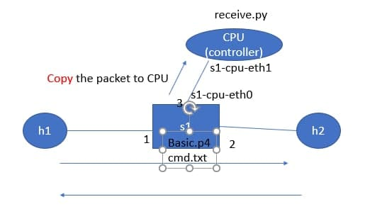
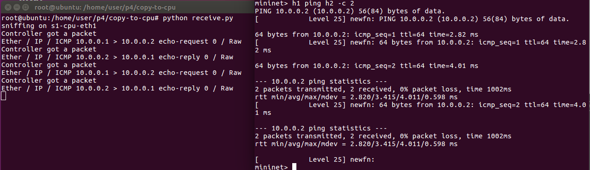
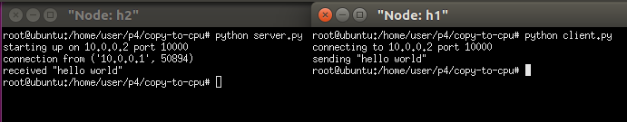
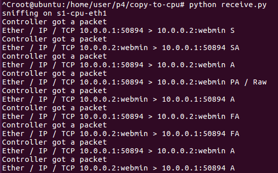
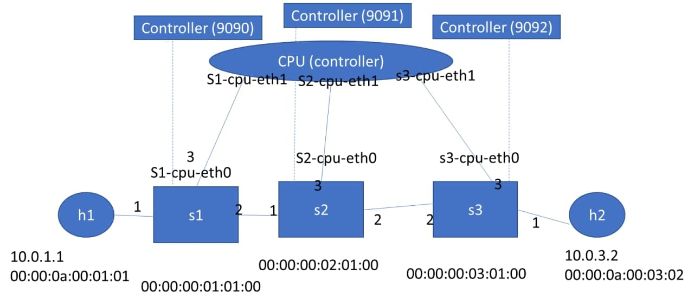

# p4(3)

## 實驗一

將傳送內容複製一份給CPU

### 實驗環境



### 程式碼內容

* p4app.json

```sh
{
  "program": "basic.p4",
  "switch": "simple_switch",
  "compiler": "p4c",
  "options": "--target bmv2 --arch v1model --std p4-16",
  "switch_cli": "simple_switch_CLI",
  "cli": true,
  "pcap_dump": true,
  "enable_log": true,
  "topo_module": {
    "file_path": "",
    "module_name": "p4utils.mininetlib.apptopo",
    "object_name": "AppTopoStrategies"
  },
  "controller_module": null,
  "topodb_module": {
    "file_path": "",
    "module_name": "p4utils.utils.topology",
    "object_name": "Topology"
  },
  "mininet_module": {
    "file_path": "",
    "module_name": "p4utils.mininetlib.p4net",
    "object_name": "P4Mininet"
  },
  "topology": {
    "assignment_strategy": "l2", 
    "links": [["h1", "s1"], ["h2", "s1"]],
    "hosts": {
      "h1": {
      },
      "h2": {
      }
    },
    "switches": {
      "s1": {
        "cli_input": "cmd.txt",
        "program": "basic.p4",
        "cpu_port": true 
      }
    }
  }
}
```
* basic.p4

```sh
/* -*- P4_16 -*- */
#include <core.p4>
#include <v1model.p4>

/*************************************************************************
*********************** H E A D E R S  ***********************************
*************************************************************************/
 
struct metadata {
    /* empty */
}

 

struct headers {
}

 

/*************************************************************************
*********************** P A R S E R  ***********************************
*************************************************************************/

parser MyParser(packet_in packet,
                out headers hdr,
                inout metadata meta,
                inout standard_metadata_t standard_metadata) {

    state start {
        transition accept;
    }

}

 

/*************************************************************************

************   C H E C K S U M    V E R I F I C A T I O N   *************

*************************************************************************/

 

control MyVerifyChecksum(inout headers hdr, inout metadata meta) {  
    apply {  }
}

/*************************************************************************
**************  I N G R E S S   P R O C E S S I N G   *******************
*************************************************************************/
control MyIngress(inout headers hdr,
                  inout metadata meta,
                  inout standard_metadata_t standard_metadata) {
    action drop() {
        mark_to_drop(standard_metadata);
    }

    action forward(bit<9> port) {
        standard_metadata.egress_spec = port;
    }

    table phy_forward {
        key = {
            standard_metadata.ingress_port: exact;
        }

        actions = {
            forward;
            drop;
        }
        size = 1024;
        default_action = drop();
    }

    apply {
        phy_forward.apply();
    }
}

/*************************************************************************
****************  E G R E S S   P R O C E S S I N G   *******************
*************************************************************************/

control MyEgress(inout headers hdr,
                 inout metadata meta,
                 inout standard_metadata_t standard_metadata) {
    apply {  
        if (standard_metadata.instance_type == 0 ){

        // 以egress to egress方式進行複製並定義section id為100 
         clone(CloneType.E2E,100);
        }
    }
}

/*************************************************************************
*************   C H E C K S U M    C O M P U T A T I O N   **************
*************************************************************************/

control MyComputeChecksum(inout headers  hdr, inout metadata meta) {
     apply {
    }
}

/*************************************************************************
***********************  D E P A R S E R  *******************************
*************************************************************************/

control MyDeparser(packet_out packet, in headers hdr) {
    apply {
    }
}

/*************************************************************************
***********************  S W I T C H  *******************************
*************************************************************************/

V1Switch(
MyParser(),
MyVerifyChecksum(),
MyIngress(),
MyEgress(),
MyComputeChecksum(),
MyDeparser()

) main;
```

* cmd.txt

```sh
table_add phy_forward forward 1 => 2
table_add phy_forward forward 2 => 1

// 將section id 100的內容複製一份往port3丟
mirroring_add 100 3
```

* receive.py

```sh
#!/usr/bin/env python
import sys
import struct
import os

from scapy.all import sniff, sendp, hexdump, get_if_list, get_if_hwaddr, bind_layers
from scapy.all import Packet, IPOption, Ether
from scapy.all import ShortField, IntField, LongField, BitField, FieldListField, FieldLenField
from scapy.all import IP, UDP, Raw, ls
from scapy.layers.inet import _IPOption_HDR

class CpuHeader(Packet):
    name = 'CpuPacket'
    fields_desc = [BitField("device_id",0,16), BitField('reason',0,16), BitField('counter', 0, 80)]

bind_layers(CpuHeader, Ether)

def handle_pkt(pkt):
    print "Controller got a packet"
    print pkt.summary()

def main():
    if len(sys.argv) < 2:
        iface = 's1-cpu-eth1'
    else:
        iface = sys.argv[1]

    print "sniffing on %s" % iface
    sys.stdout.flush()
    sniff(iface = iface,
          prn = lambda x: handle_pkt(x))

if __name__ == '__main__':
    main()
```

### 實驗結果

  

## 實驗二

延續上個實驗，增加tcp server。h1作為client端，h2為server端


### 程式碼內容

* server.py

```sh
import socket
import sys

# Create a TCP/IP socket
sock = socket.socket(socket.AF_INET, socket.SOCK_STREAM)

# Bind the socket to the port
server_address = ('10.0.0.2', 10000)
print >>sys.stderr, 'starting up on %s port %s' % server_address
sock.bind(server_address)

# Listen for incoming connections
sock.listen(1)

connection, client_address = sock.accept()
print >>sys.stderr, 'connection from', client_address
data = connection.recv(1024)
print >>sys.stderr, 'received "%s"' % data
connection.close()
```

* client.py

```sh
import socket
import sys

# Create a TCP/IP socket
sock = socket.socket(socket.AF_INET, socket.SOCK_STREAM)

# Connect the socket to the port where the server is listening
server_address = ('10.0.0.2', 10000)
print >>sys.stderr, 'connecting to %s port %s' % server_address
sock.connect(server_address)

# Send data
message = 'hello world'
print >>sys.stderr, 'sending "%s"' % message
sock.sendall(message)
sock.close()
```

### 實驗結果





## 實驗三

### 實驗環境



### 程式碼內容

* p4app.json

```sh
{
  "program": "send_to_cpu.p4",
  "switch": "simple_switch",
  "compiler": "p4c",
  "options": "--target bmv2 --arch v1model --std p4-16",
  "switch_cli": "simple_switch_CLI",
  "cli": true,
  "pcap_dump": true,
  "enable_log": true,
  "cpu_port": true,
  "topo_module": {
    "file_path": "",
    "module_name": "p4utils.mininetlib.apptopo",
    "object_name": "AppTopo"
  },
  "controller_module": null,
  "topodb_module": {
    "file_path": "",
    "module_name": "p4utils.utils.topology",
    "object_name": "Topology"
  },
  "mininet_module": {
    "file_path": "",
    "module_name": "p4utils.mininetlib.p4net",
    "object_name": "P4Mininet"
  },
  "topology": {
    "links": [["h1","s1"], ["s3","h2"], ["s1","s2"], ["s2","s3"]],
    "hosts": {
      "h1": {
      },
      "h2": {
      }
    },
    "switches": {
      "s1": {
        "cli_input": "s1-commands.txt",
        "program": "send_to_cpu.p4",
        "cpu_port": true
      },
      "s2": {
        "cli_input": "s2-commands.txt",
        "program": "send_to_cpu.p4",
        "cpu_port": true
      },
      "s3": {
        "cli_input": "s3-commands.txt",
        "program": "send_to_cpu.p4",
        "cpu_port": true
      }		
    }
  }

}
```

* send_to_cpu.p4

```sh
/* -*- P4_16 -*- */
#include <core.p4>
#include <v1model.p4>

const bit<16> TYPE_IPV4 = 0x800;

/*************************************************************************
*********************** H E A D E R S  ***********************************
*************************************************************************/

typedef bit<9>  egressSpec_t;
typedef bit<48> macAddr_t;
typedef bit<32> ip4Addr_t;

header ethernet_t {
    macAddr_t dstAddr;
    macAddr_t srcAddr;
    bit<16>   etherType;
}

header ipv4_t {
    bit<4>    version;
    bit<4>    ihl;
    bit<8>    tos;
    bit<16>   totalLen;
    bit<16>   identification;
    bit<3>    flags;
    bit<13>   fragOffset;
    bit<8>    ttl;
    bit<8>    protocol;
    bit<16>   hdrChecksum;
    ip4Addr_t srcAddr;
    ip4Addr_t dstAddr;
}

struct metadata {	
}

struct headers {
    ethernet_t   ethernet;
    ipv4_t       ipv4;
}

/*************************************************************************
*********************** P A R S E R  ***********************************
*************************************************************************/

parser MyParser(packet_in packet,
                out headers hdr,
                inout metadata meta,
                inout standard_metadata_t standard_metadata) {

    state start {

        packet.extract(hdr.ethernet);
        transition select(hdr.ethernet.etherType){

            TYPE_IPV4: ipv4;
            default: accept;
        }

    }

    state ipv4 {

        packet.extract(hdr.ipv4);
        transition accept;
    }

}


/*************************************************************************
************   C H E C K S U M    V E R I F I C A T I O N   *************
*************************************************************************/

control MyVerifyChecksum(inout headers hdr, inout metadata meta) {
    apply {  }
}


/*************************************************************************
**************  I N G R E S S   P R O C E S S I N G   *******************
*************************************************************************/

control MyIngress(inout headers hdr,
                  inout metadata meta,
                  inout standard_metadata_t standard_metadata) {

    action drop() {
        mark_to_drop(standard_metadata);
    }

    action ipv4_forward(macAddr_t dstAddr, egressSpec_t port) {

        //set the src mac address as the previous dst, this is not correct right?
        hdr.ethernet.srcAddr = hdr.ethernet.dstAddr;

       //set the destination mac address that we got from the match in the table
        hdr.ethernet.dstAddr = dstAddr;

        //set the output port that we also get from the table
        standard_metadata.egress_spec = port;

        //decrease ttl by 1
        hdr.ipv4.ttl = hdr.ipv4.ttl -1;

    }

    table ipv4_lpm {
        key = {
            hdr.ipv4.dstAddr: lpm;
        }
        actions = {
            ipv4_forward;
            drop;
            NoAction;
        }
        size = 1024;
        default_action = NoAction();
    }

    apply {

        //only if IPV4 the rule is applied. Therefore other packets will not be forwarded.
        if (hdr.ipv4.isValid()){
            ipv4_lpm.apply();

        }
    }
}

/*************************************************************************
****************  E G R E S S   P R O C E S S I N G   *******************
*************************************************************************/

control MyEgress(inout headers hdr,
                 inout metadata meta,
                 inout standard_metadata_t standard_metadata) {
    apply {

     if (standard_metadata.instance_type == 0 ){
         clone3(CloneType.E2E,100, meta);
     }

     //handle the cloned packet
     if (standard_metadata.instance_type != 0){
	 truncate((bit<32>)34); //ether+ip header
     }
    }
}

/*************************************************************************
*************   C H E C K S U M    C O M P U T A T I O N   **************
*************************************************************************/

control MyComputeChecksum(inout headers hdr, inout metadata meta) {
     apply {
	update_checksum(
	    hdr.ipv4.isValid(),
            { hdr.ipv4.version,
	      hdr.ipv4.ihl,
              hdr.ipv4.tos,
              hdr.ipv4.totalLen,
              hdr.ipv4.identification,
              hdr.ipv4.flags,
              hdr.ipv4.fragOffset,
              hdr.ipv4.ttl,
              hdr.ipv4.protocol,
              hdr.ipv4.srcAddr,
              hdr.ipv4.dstAddr },
            hdr.ipv4.hdrChecksum,
            HashAlgorithm.csum16);
    }
}


/*************************************************************************
***********************  D E P A R S E R  *******************************
*************************************************************************/

control MyDeparser(packet_out packet, in headers hdr) {
    apply {

        //parsed headers have to be added again into the packet.
	packet.emit(hdr.ethernet);        
        packet.emit(hdr.ipv4);

    }
}

/*************************************************************************
***********************  S W I T C H  *******************************
*************************************************************************/

//switch architecture
V1Switch(
MyParser(),
MyVerifyChecksum(),
MyIngress(),
MyEgress(),
MyComputeChecksum(),
MyDeparser()
) main;
```

* s1-commands.txt

```sh
table_set_default ipv4_lpm drop
table_add MyIngress.ipv4_lpm ipv4_forward 10.0.1.0/24 => 00:00:0a:00:01:01 1
table_add MyIngress.ipv4_lpm ipv4_forward 10.0.3.0/24 => 00:00:00:02:01:00 2

//creates a mirroring ID 100 to output port 3
mirroring_add 100 3
```

* s2-commands.txt

```sh
table_set_default ipv4_lpm drop
table_add MyIngress.ipv4_lpm ipv4_forward 10.0.1.0/24 => 00:00:00:01:01:00 1
table_add MyIngress.ipv4_lpm ipv4_forward 10.0.3.0/24 => 00:00:00:03:01:00 2

//creates a mirroring ID 100 to output port 3
//mirroring_add 100 3
```

* s3-commands.txt

```sh
table_set_default ipv4_lpm drop
table_add MyIngress.ipv4_lpm ipv4_forward 10.0.1.0/24 => 00:00:00:02:01:00 2
table_add MyIngress.ipv4_lpm ipv4_forward 10.0.3.2/32 => 00:00:0a:00:03:02 1

//creates a mirroring ID 100 to output port 3
mirroring_add 100 3
```

### 實驗結果