# p4(3)

[toc]

## 實驗一

將傳送內容複製一份給CPU

### 實驗環境


### 程式碼內容

* p4app.json

```sh
{
  "program": "basic.p4",
  "switch": "simple_switch",
  "compiler": "p4c",
  "options": "--target bmv2 --arch v1model --std p4-16",
  "switch_cli": "simple_switch_CLI",
  "cli": true,
  "pcap_dump": true,
  "enable_log": true,
  "topo_module": {
    "file_path": "",
    "module_name": "p4utils.mininetlib.apptopo",
    "object_name": "AppTopoStrategies"
  },
  "controller_module": null,
  "topodb_module": {
    "file_path": "",
    "module_name": "p4utils.utils.topology",
    "object_name": "Topology"
  },
  "mininet_module": {
    "file_path": "",
    "module_name": "p4utils.mininetlib.p4net",
    "object_name": "P4Mininet"
  },
  "topology": {
    "assignment_strategy": "l2", 
    "links": [["h1", "s1"], ["h2", "s1"]],
    "hosts": {
      "h1": {
      },
      "h2": {
      }
    },
    "switches": {
      "s1": {
        "cli_input": "cmd.txt",
        "program": "basic.p4",
        "cpu_port": true 
      }
    }
  }
}
```
* basic.p4

```sh
/* -*- P4_16 -*- */
#include <core.p4>
#include <v1model.p4>

/*************************************************************************
*********************** H E A D E R S  ***********************************
*************************************************************************/
 
struct metadata {
    /* empty */
}

 

struct headers {
}

 

/*************************************************************************
*********************** P A R S E R  ***********************************
*************************************************************************/

parser MyParser(packet_in packet,
                out headers hdr,
                inout metadata meta,
                inout standard_metadata_t standard_metadata) {

    state start {
        transition accept;
    }

}

 

/*************************************************************************

************   C H E C K S U M    V E R I F I C A T I O N   *************

*************************************************************************/

 

control MyVerifyChecksum(inout headers hdr, inout metadata meta) {  
    apply {  }
}

/*************************************************************************
**************  I N G R E S S   P R O C E S S I N G   *******************
*************************************************************************/
control MyIngress(inout headers hdr,
                  inout metadata meta,
                  inout standard_metadata_t standard_metadata) {
    action drop() {
        mark_to_drop(standard_metadata);
    }

    action forward(bit<9> port) {
        standard_metadata.egress_spec = port;
    }

    table phy_forward {
        key = {
            standard_metadata.ingress_port: exact;
        }

        actions = {
            forward;
            drop;
        }
        size = 1024;
        default_action = drop();
    }

    apply {
        phy_forward.apply();
    }
}

/*************************************************************************
****************  E G R E S S   P R O C E S S I N G   *******************
*************************************************************************/

control MyEgress(inout headers hdr,
                 inout metadata meta,
                 inout standard_metadata_t standard_metadata) {
    apply {  
        if (standard_metadata.instance_type == 0 ){

        // 以egress to egress方式進行複製並定義section id為100 
         clone(CloneType.E2E,100);
        }
    }
}

/*************************************************************************
*************   C H E C K S U M    C O M P U T A T I O N   **************
*************************************************************************/

control MyComputeChecksum(inout headers  hdr, inout metadata meta) {
     apply {
    }
}

/*************************************************************************
***********************  D E P A R S E R  *******************************
*************************************************************************/

control MyDeparser(packet_out packet, in headers hdr) {
    apply {
    }
}

/*************************************************************************
***********************  S W I T C H  *******************************
*************************************************************************/

V1Switch(
MyParser(),
MyVerifyChecksum(),
MyIngress(),
MyEgress(),
MyComputeChecksum(),
MyDeparser()

) main;
```

* cmd.txt

```sh
table_add phy_forward forward 1 => 2
table_add phy_forward forward 2 => 1

// 將section id 100的內容複製一份往port3丟
mirroring_add 100 3
```

* receive.py

```sh
 #!/usr/bin/env python
import sys
import struct
import os

from scapy.all import sniff, sendp, hexdump, get_if_list, get_if_hwaddr, bind_layers
from scapy.all import Packet, IPOption, Ether
from scapy.all import ShortField, IntField, LongField, BitField, FieldListField, FieldLenField
from scapy.all import IP, UDP, Raw, ls
from scapy.layers.inet import _IPOption_HDR

class CpuHeader(Packet):
    name = 'CpuPacket'
    fields_desc = [BitField("device_id",0,16), BitField('reason',0,16), BitField('counter', 0, 80)]

bind_layers(CpuHeader, Ether)

def handle_pkt(pkt):
    print "Controller got a packet"
    print pkt.summary()

def main():
    if len(sys.argv) < 2:
        iface = 's1-cpu-eth1'
    else:
        iface = sys.argv[1]

    print "sniffing on %s" % iface
    sys.stdout.flush()
    sniff(iface = iface,
          prn = lambda x: handle_pkt(x))

if __name__ == '__main__':
    main()
```

### 實驗結果

  

## 實驗二

延續上個實驗，增加tcp server。h1作為client端，h2為server端


### 程式碼內容

* server.py

```sh
import socket
import sys

# Create a TCP/IP socket
sock = socket.socket(socket.AF_INET, socket.SOCK_STREAM)

# Bind the socket to the port
server_address = ('10.0.0.2', 10000)
print >>sys.stderr, 'starting up on %s port %s' % server_address
sock.bind(server_address)

# Listen for incoming connections
sock.listen(1)

connection, client_address = sock.accept()
print >>sys.stderr, 'connection from', client_address
data = connection.recv(1024)
print >>sys.stderr, 'received "%s"' % data
connection.close()
```

* client.py

```sh
import socket
import sys

# Create a TCP/IP socket
sock = socket.socket(socket.AF_INET, socket.SOCK_STREAM)

# Connect the socket to the port where the server is listening
server_address = ('10.0.0.2', 10000)
print >>sys.stderr, 'connecting to %s port %s' % server_address
sock.connect(server_address)

# Send data
message = 'hello world'
print >>sys.stderr, 'sending "%s"' % message
sock.sendall(message)
sock.close()
```

### 實驗結果


## 實驗三

手動設定路徑轉發

### 實驗環境


### 程式碼內容

* p4app.json

```sh
{
  "program": "send_to_cpu.p4",
  "switch": "simple_switch",
  "compiler": "p4c",
  "options": "--target bmv2 --arch v1model --std p4-16",
  "switch_cli": "simple_switch_CLI",
  "cli": true,
  "pcap_dump": true,
  "enable_log": true,
  "cpu_port": true,
  "topo_module": {
    "file_path": "",
    "module_name": "p4utils.mininetlib.apptopo",
    "object_name": "AppTopo"
  },
  "controller_module": null,
  "topodb_module": {
    "file_path": "",
    "module_name": "p4utils.utils.topology",
    "object_name": "Topology"
  },
  "mininet_module": {
    "file_path": "",
    "module_name": "p4utils.mininetlib.p4net",
    "object_name": "P4Mininet"
  },
  "topology": {
    "links": [["h1","s1"], ["s3","h2"], ["s1","s2"], ["s2","s3"]],
    "hosts": {
      "h1": {
      },
      "h2": {
      }
    },
    "switches": {
      "s1": {
        "cli_input": "s1-commands.txt",
        "program": "send_to_cpu.p4",
        "cpu_port": true
      },
      "s2": {
        "cli_input": "s2-commands.txt",
        "program": "send_to_cpu.p4",
        "cpu_port": true
      },
      "s3": {
        "cli_input": "s3-commands.txt",
        "program": "send_to_cpu.p4",
        "cpu_port": true
      }		
    }
  }

}
```

* send_to_cpu.p4

```sh
/* -*- P4_16 -*- */
#include <core.p4>
#include <v1model.p4>

const bit<16> TYPE_IPV4 = 0x800;

/*************************************************************************
*********************** H E A D E R S  ***********************************
*************************************************************************/

typedef bit<9>  egressSpec_t;
typedef bit<48> macAddr_t;
typedef bit<32> ip4Addr_t;

header ethernet_t {
    macAddr_t dstAddr;
    macAddr_t srcAddr;
    bit<16>   etherType;
}

header ipv4_t {
    bit<4>    version;
    bit<4>    ihl;
    bit<8>    tos;
    bit<16>   totalLen;
    bit<16>   identification;
    bit<3>    flags;
    bit<13>   fragOffset;
    bit<8>    ttl;
    bit<8>    protocol;
    bit<16>   hdrChecksum;
    ip4Addr_t srcAddr;
    ip4Addr_t dstAddr;
}

struct metadata {	
}

struct headers {
    ethernet_t   ethernet;
    ipv4_t       ipv4;
}

/*************************************************************************
*********************** P A R S E R  ***********************************
*************************************************************************/

parser MyParser(packet_in packet,
                out headers hdr,
                inout metadata meta,
                inout standard_metadata_t standard_metadata) {

    state start {

        packet.extract(hdr.ethernet);
        transition select(hdr.ethernet.etherType){

            TYPE_IPV4: ipv4;
            default: accept;
        }

    }

    state ipv4 {

        packet.extract(hdr.ipv4);
        transition accept;
    }

}


/*************************************************************************
************   C H E C K S U M    V E R I F I C A T I O N   *************
*************************************************************************/

control MyVerifyChecksum(inout headers hdr, inout metadata meta) {
    apply {  }
}


/*************************************************************************
**************  I N G R E S S   P R O C E S S I N G   *******************
*************************************************************************/

control MyIngress(inout headers hdr,
                  inout metadata meta,
                  inout standard_metadata_t standard_metadata) {

    action drop() {
        mark_to_drop(standard_metadata);
    }

    action ipv4_forward(macAddr_t dstAddr, egressSpec_t port) {

        //set the src mac address as the previous dst, this is not correct right?
        hdr.ethernet.srcAddr = hdr.ethernet.dstAddr;

       //set the destination mac address that we got from the match in the table
        hdr.ethernet.dstAddr = dstAddr;

        //set the output port that we also get from the table
        standard_metadata.egress_spec = port;

        //decrease ttl by 1
        hdr.ipv4.ttl = hdr.ipv4.ttl -1;

    }

    table ipv4_lpm {
        key = {
            hdr.ipv4.dstAddr: lpm;
        }
        actions = {
            ipv4_forward;
            drop;
            NoAction;
        }
        size = 1024;
        default_action = NoAction();
    }

    apply {

        //only if IPV4 the rule is applied. Therefore other packets will not be forwarded.
        if (hdr.ipv4.isValid()){
            ipv4_lpm.apply();

        }
    }
}

/*************************************************************************
****************  E G R E S S   P R O C E S S I N G   *******************
*************************************************************************/

control MyEgress(inout headers hdr,
                 inout metadata meta,
                 inout standard_metadata_t standard_metadata) {
    apply {

     if (standard_metadata.instance_type == 0 ){
         clone3(CloneType.E2E,100, meta);
     }

     //handle the cloned packet
     if (standard_metadata.instance_type != 0){
	 truncate((bit<32>)34); //ether+ip header
     }
    }
}

/*************************************************************************
*************   C H E C K S U M    C O M P U T A T I O N   **************
*************************************************************************/

control MyComputeChecksum(inout headers hdr, inout metadata meta) {
     apply {
	update_checksum(
	    hdr.ipv4.isValid(),
            { hdr.ipv4.version,
	      hdr.ipv4.ihl,
              hdr.ipv4.tos,
              hdr.ipv4.totalLen,
              hdr.ipv4.identification,
              hdr.ipv4.flags,
              hdr.ipv4.fragOffset,
              hdr.ipv4.ttl,
              hdr.ipv4.protocol,
              hdr.ipv4.srcAddr,
              hdr.ipv4.dstAddr },
            hdr.ipv4.hdrChecksum,
            HashAlgorithm.csum16);
    }
}


/*************************************************************************
***********************  D E P A R S E R  *******************************
*************************************************************************/

control MyDeparser(packet_out packet, in headers hdr) {
    apply {

        //parsed headers have to be added again into the packet.
	packet.emit(hdr.ethernet);        
        packet.emit(hdr.ipv4);

    }
}

/*************************************************************************
***********************  S W I T C H  *******************************
*************************************************************************/

//switch architecture
V1Switch(
MyParser(),
MyVerifyChecksum(),
MyIngress(),
MyEgress(),
MyComputeChecksum(),
MyDeparser()
) main;
```

* s1-commands.txt

```sh
table_set_default ipv4_lpm drop
table_add MyIngress.ipv4_lpm ipv4_forward 10.0.1.0/24 => 00:00:0a:00:01:01 1
table_add MyIngress.ipv4_lpm ipv4_forward 10.0.3.0/24 => 00:00:00:02:01:00 2

//creates a mirroring ID 100 to output port 3
mirroring_add 100 3
```

* s2-commands.txt

```sh
table_set_default ipv4_lpm drop
table_add MyIngress.ipv4_lpm ipv4_forward 10.0.1.0/24 => 00:00:00:01:01:00 1
table_add MyIngress.ipv4_lpm ipv4_forward 10.0.3.0/24 => 00:00:00:03:01:00 2

//creates a mirroring ID 100 to output port 3
//mirroring_add 100 3
```

* s3-commands.txt

```sh
table_set_default ipv4_lpm drop
table_add MyIngress.ipv4_lpm ipv4_forward 10.0.1.0/24 => 00:00:00:02:01:00 2
table_add MyIngress.ipv4_lpm ipv4_forward 10.0.3.2/32 => 00:00:0a:00:03:02 1

//creates a mirroring ID 100 to output port 3
mirroring_add 100 3
```

* controller.py

```sh
import nnpy
import struct
from p4utils.utils.topology import Topology
from p4utils.utils.sswitch_API import SimpleSwitchAPI
from scapy.all import Ether, sniff, Packet, BitField

class myController(object):

    def __init__(self):
        self.topo = Topology(db="topology.db")
	self.controllers = {}
	self.connect_to_switches()

    def connect_to_switches(self):
        for p4switch in self.topo.get_p4switches():
            thrift_port = self.topo.get_thrift_port(p4switch)
            #print "p4switch:", p4switch, "thrift_port:", thrift_port
            self.controllers[p4switch] = SimpleSwitchAPI(thrift_port) 	

    def recv_msg_cpu(self, pkt):
	print "interface:", pkt.sniffed_on
	print "summary:", pkt.summary()
      
    def run_cpu_port_loop(self):
        cpu_interfaces = [str(self.topo.get_cpu_port_intf(sw_name).replace("eth0", "eth1")) for sw_name in self.controllers]
	sniff(iface=cpu_interfaces, prn=self.recv_msg_cpu)
        
if __name__ == "__main__":
    controller = myController()
    controller.run_cpu_port_loop()
```

### 實驗結果

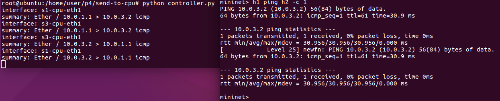

## 實驗四

延續上個實驗，自動設定轉發

### 程式碼內容
> 修改上個實驗的程式碼

* p4app.json

```sh
{
  "program": "send_to_cpu.p4",
  "switch": "simple_switch",
  "compiler": "p4c",
  "options": "--target bmv2 --arch v1model --std p4-16",
  "switch_cli": "simple_switch_CLI",
  "cli": true,
  "pcap_dump": true,
  "enable_log": true,
  "cpu_port": true,
  "topo_module": {
    "file_path": "",
    "module_name": "p4utils.mininetlib.apptopo",
    "object_name": "AppTopo"
  },
  "controller_module": null,
  "topodb_module": {
    "file_path": "",
    "module_name": "p4utils.utils.topology",
    "object_name": "Topology"
  },
  "mininet_module": {
    "file_path": "",
    "module_name": "p4utils.mininetlib.p4net",
    "object_name": "P4Mininet"
  },
  "topology": {
    "links": [["h1","s1"], ["s3","h2"], ["s1","s2"], ["s2","s3"]],
    "hosts": {
      "h1": {
      },
      "h2": {
      }
    },
    "switches": {
      "s1": {
        "cli_input": "s1-commands.txt",
        "program": "send_to_cpu.p4",
        "cpu_port": true
      },
      "s2": {
        "cli_input": "s2-commands.txt",
        "program": "send_to_cpu.p4",
        "cpu_port": true
      },
      "s3": {
        "cli_input": "s3-commands.txt",
        "program": "send_to_cpu.p4",
        "cpu_port": true
      }		
    }
  }

}
```

* send_to_cpu.p4

```sh
/* -*- P4_16 -*- */
#include <core.p4>
#include <v1model.p4>

const bit<16> TYPE_IPV4 = 0x800;

/*************************************************************************
*********************** H E A D E R S  ***********************************
*************************************************************************/

typedef bit<9>  egressSpec_t;
typedef bit<48> macAddr_t;
typedef bit<32> ip4Addr_t;

header ethernet_t {
    macAddr_t dstAddr;
    macAddr_t srcAddr;
    bit<16>   etherType;
}

header ipv4_t {
    bit<4>    version;
    bit<4>    ihl;
    bit<8>    tos;
    bit<16>   totalLen;
    bit<16>   identification;
    bit<3>    flags;
    bit<13>   fragOffset;
    bit<8>    ttl;
    bit<8>    protocol;
    bit<16>   hdrChecksum;
    ip4Addr_t srcAddr;
    ip4Addr_t dstAddr;
}

struct metadata {	
}

struct headers {
    ethernet_t   ethernet;
    ipv4_t       ipv4;
}

/*************************************************************************
*********************** P A R S E R  ***********************************
*************************************************************************/

parser MyParser(packet_in packet,
                out headers hdr,
                inout metadata meta,
                inout standard_metadata_t standard_metadata) {

    state start {

        packet.extract(hdr.ethernet);
        transition select(hdr.ethernet.etherType){

            TYPE_IPV4: ipv4;
            default: accept;
        }

    }

    state ipv4 {

        packet.extract(hdr.ipv4);
        transition accept;
    }

}


/*************************************************************************
************   C H E C K S U M    V E R I F I C A T I O N   *************
*************************************************************************/

control MyVerifyChecksum(inout headers hdr, inout metadata meta) {
    apply {  }
}


/*************************************************************************
**************  I N G R E S S   P R O C E S S I N G   *******************
*************************************************************************/

control MyIngress(inout headers hdr,
                  inout metadata meta,
                  inout standard_metadata_t standard_metadata) {

    action drop() {
        mark_to_drop(standard_metadata);
    }

    action ipv4_forward(macAddr_t dstAddr, egressSpec_t port) {

        //set the src mac address as the previous dst, this is not correct right?
        hdr.ethernet.srcAddr = hdr.ethernet.dstAddr;

       //set the destination mac address that we got from the match in the table
        hdr.ethernet.dstAddr = dstAddr;

        //set the output port that we also get from the table
        standard_metadata.egress_spec = port;

        //decrease ttl by 1
        hdr.ipv4.ttl = hdr.ipv4.ttl -1;

    }

    action to_cpu(egressSpec_t port) {
        standard_metadata.egress_spec = port;
    }

    table ipv4_lpm {
        key = {
            hdr.ipv4.dstAddr: lpm;
        }
        actions = {
            ipv4_forward;
	    to_cpu;	
            drop;
        }
        size = 1024;
    }

    apply {

        //only if IPV4 the rule is applied. Therefore other packets will not be forwarded.
        if (hdr.ipv4.isValid()){
            ipv4_lpm.apply();

        }
    }
}

/*************************************************************************
****************  E G R E S S   P R O C E S S I N G   *******************
*************************************************************************/

control MyEgress(inout headers hdr,
                 inout metadata meta,
                 inout standard_metadata_t standard_metadata) {
    apply {
    }
}

/*************************************************************************
*************   C H E C K S U M    C O M P U T A T I O N   **************
*************************************************************************/

control MyComputeChecksum(inout headers hdr, inout metadata meta) {
     apply {
	update_checksum(
	    hdr.ipv4.isValid(),
            { hdr.ipv4.version,
	      hdr.ipv4.ihl,
              hdr.ipv4.tos,
              hdr.ipv4.totalLen,
              hdr.ipv4.identification,
              hdr.ipv4.flags,
              hdr.ipv4.fragOffset,
              hdr.ipv4.ttl,
              hdr.ipv4.protocol,
              hdr.ipv4.srcAddr,
              hdr.ipv4.dstAddr },
            hdr.ipv4.hdrChecksum,
            HashAlgorithm.csum16);
    }
}


/*************************************************************************
***********************  D E P A R S E R  *******************************
*************************************************************************/

control MyDeparser(packet_out packet, in headers hdr) {
    apply {

        //parsed headers have to be added again into the packet.
	packet.emit(hdr.ethernet);        
        packet.emit(hdr.ipv4);

    }
}

/*************************************************************************
***********************  S W I T C H  *******************************
*************************************************************************/

//switch architecture
V1Switch(
MyParser(),
MyVerifyChecksum(),
MyIngress(),
MyEgress(),
MyComputeChecksum(),
MyDeparser()
) main;
```

* s1-commands.txt

```sh
table_set_default ipv4_lpm to_cpu 3
```

* s2-commands.txt


* s3-commands.txt

```sh
table_set_default ipv4_lpm to_cpu 3
```

* controller.py

```sh
import nnpy
import struct
from p4utils.utils.topology import Topology
from p4utils.utils.sswitch_API import SimpleSwitchAPI
#from scapy.all import Ether, sniff, Packet, BitField
from scapy.all import *

rules=[]

class myController(object):

    def __init__(self):
        self.topo = Topology(db="topology.db")
	self.controllers = {}
	self.connect_to_switches()
        
    def connect_to_switches(self):
        for p4switch in self.topo.get_p4switches():
            thrift_port = self.topo.get_thrift_port(p4switch)
            #print "p4switch:", p4switch, "thrift_port:", thrift_port
            self.controllers[p4switch] = SimpleSwitchAPI(thrift_port) 	

    def recv_msg_cpu(self, pkt):
        print "-------------------------------------------------------------------"
	global rules
	print "interface:", pkt.sniffed_on
	print "summary:", pkt.summary()
        if IP in pkt:
          ip_src=pkt[IP].src
          ip_dst=pkt[IP].dst
          print "ip_src:", ip_src, " ip_dst:", ip_dst
	  if (ip_src, ip_dst) not in rules:
            rules.append((ip_src, ip_dst))
            print "rules:", rules
          else:
	    return 
       
        switches = {sw_name:{} for sw_name in self.topo.get_p4switches().keys()}
        #print "switches:", switches
        for sw_name, controller in self.controllers.items():
         for host in self.topo.get_hosts_connected_to(sw_name):
           host_ip_addr = self.topo.get_host_ip(host)
	   if ip_src == host_ip_addr:
             sw_src = sw_name
             
           if ip_dst == host_ip_addr:
	     sw_dst = sw_name  
             sw_port = self.topo.node_to_node_port_num(sw_name, host)
             host_ip = self.topo.get_host_ip(host) + "/32"
             host_mac = self.topo.get_host_mac(host)
             #print host, "(", host_ip, host_mac, ")", "-->", sw_name, "with port:", sw_port
 
             #add rule
             print "table_add at {}:".format(sw_name)
             self.controllers[sw_name].table_add("ipv4_lpm", "ipv4_forward", [str(host_ip)], [str(host_mac), str(sw_port)])

        print "sw_src:", sw_src, "sw_dst:", sw_dst   
        paths = self.topo.get_shortest_paths_between_nodes(sw_src, sw_dst)
        sw_1=sw_src
        for next_hop in paths[0][1:]:
         host_ip = ip_dst + "/32"
         sw_port = self.topo.node_to_node_port_num(sw_1, next_hop)
         dst_sw_mac = self.topo.node_to_node_mac(next_hop, sw_1)
         #add rule
         print "table_add at {}:".format(sw_1)
         self.controllers[sw_1].table_add("ipv4_lpm", "ipv4_forward", [str(host_ip)],
                                                    [str(dst_sw_mac), str(sw_port)])
         sw_1=next_hop

	print "send original packet back from ", pkt.sniffed_on
        sendp(pkt, iface=pkt.sniffed_on, verbose=False)
            

 
      
    def run_cpu_port_loop(self):
        cpu_interfaces = [str(self.topo.get_cpu_port_intf(sw_name).replace("eth0", "eth1")) for sw_name in self.controllers]
	sniff(iface=cpu_interfaces, prn=self.recv_msg_cpu)
        
if __name__ == "__main__":
    controller = myController()
    controller.run_cpu_port_loop()
```

### 實驗結果

* 未執行controller.py

  * h1
  
  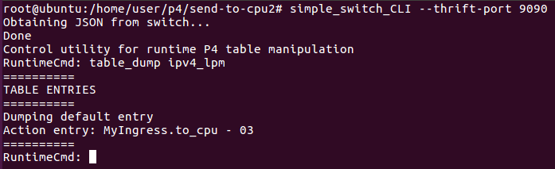 

  * h2
  
  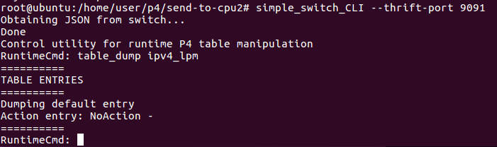

  * h3
  
  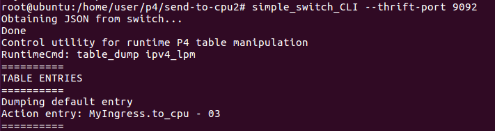

* 執行controller.py
    > 執行`h1 ping h2 -c 2`
  
  * h1
  
  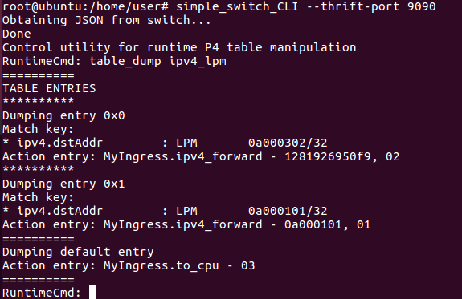

  * h2
  
  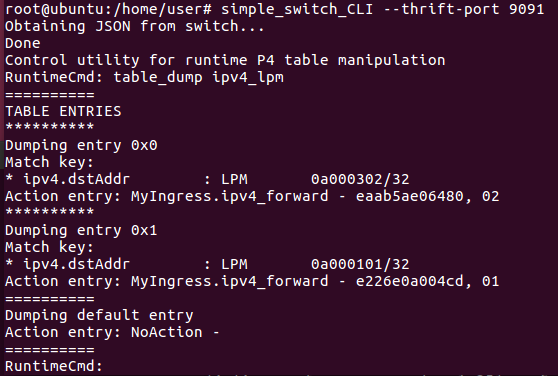

  * h3
  
  

---
# Broadcast & Multicast

## 實驗五

### 實驗環境

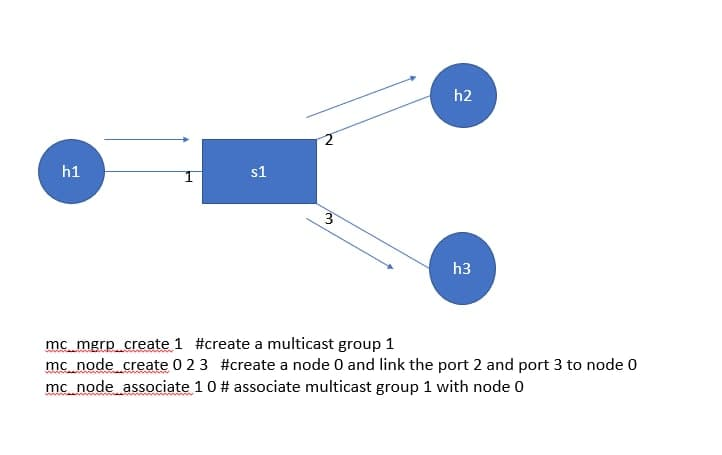

### 程式碼內容

* p4app.json

```sh
{
  "program": "basic.p4",
  "switch": "simple_switch",
  "compiler": "p4c",
  "options": "--target bmv2 --arch v1model --std p4-16",
  "switch_cli": "simple_switch_CLI",
  "cli": true,
  "pcap_dump": false,
  "enable_log": true,
  "topo_module": {
    "file_path": "",
    "module_name": "p4utils.mininetlib.apptopo",
    "object_name": "AppTopoStrategies"
  },
  "controller_module": null,
  "topodb_module": {
    "file_path": "",
    "module_name": "p4utils.utils.topology",
    "object_name": "Topology"
  },
  "mininet_module": {
    "file_path": "",
    "module_name": "p4utils.mininetlib.p4net",
    "object_name": "P4Mininet"
  },
  "topology": {
    "links": [["h1", "s1"], ["h2", "s1"], ["h3", "s1"]],
    "hosts": {
      "h1": {
      },
      "h2": {
      },
      "h3": {
      }
    },
    "switches": {
      "s1": {
        "cli_input": "cmd.txt",
        "program": "basic.p4"
      }
    }
  }
}
```

* basic.p4

```sh
/* -*- P4_16 -*- */
#include <core.p4>
#include <v1model.p4>

/*************************************************************************
*********************** H E A D E R S  ***********************************
*************************************************************************/

header ethernet_t {
    bit<48> dstAddr;
    bit<48> srcAddr;
    bit<16> etherType;
}

header ipv4_t {
    bit<4>  version;
    bit<4>  ihl;
    bit<8>  diffserv;
    bit<16> totalLen;
    bit<16> identification;
    bit<3>  flags;
    bit<13> fragOffset;
    bit<8>  ttl;
    bit<8>  protocol;
    bit<16> hdrChecksum;
    bit<32> srcAddr;
    bit<32> dstAddr;
}
 
struct metadata {
    /* empty */
}

 

struct headers {
  ethernet_t   ethernet;
  ipv4_t       ipv4;
}

 

/*************************************************************************
*********************** P A R S E R  ***********************************
*************************************************************************/

parser MyParser(packet_in packet,
                out headers hdr,
                inout metadata meta,
                inout standard_metadata_t standard_metadata) {

    state parse_ethernet {
        packet.extract(hdr.ethernet);
        transition select(hdr.ethernet.etherType) {
            16w0x800: parse_ipv4;
            default: accept;
        }
    }
    state parse_ipv4 {
        packet.extract(hdr.ipv4);
        transition accept;
    }
    state start {
        transition parse_ethernet;
    }
}

 

/*************************************************************************
************   C H E C K S U M    V E R I F I C A T I O N   *************
*************************************************************************/
control MyVerifyChecksum(inout headers hdr, inout metadata meta) {  
    apply {  }
}

/*************************************************************************
**************  I N G R E S S   P R O C E S S I N G   *******************
*************************************************************************/
control MyIngress(inout headers hdr,
                  inout metadata meta,
                  inout standard_metadata_t standard_metadata) {
    action drop() {
        mark_to_drop(standard_metadata);
    }

    action forward(bit<9> port) {
        standard_metadata.egress_spec = port;
    }

    table mac_forward {
        key = {
            hdr.ethernet.dstAddr: exact;
        }

        actions = {
            forward;
            drop;
        }
        size = 1024;
        default_action = drop();
    }

    action broadcast(bit<16> mcast_grp_id) {
        standard_metadata.mcast_grp = mcast_grp_id;
    }

    table ip_broadcast {
        key = {
            hdr.ipv4.dstAddr: exact;
            standard_metadata.ingress_port: exact;
        }

        actions = {
            broadcast;
            NoAction;
        }
        size = 1024;
        default_action = NoAction();
    }

    apply {
        if (!ip_broadcast.apply().hit){
          mac_forward.apply();
        }
    }
}

/*************************************************************************
****************  E G R E S S   P R O C E S S I N G   *******************
*************************************************************************/

control MyEgress(inout headers hdr,
                 inout metadata meta,
                 inout standard_metadata_t standard_metadata) {
    apply {  }
}

/*************************************************************************
*************   C H E C K S U M    C O M P U T A T I O N   **************
*************************************************************************/

control MyComputeChecksum(inout headers  hdr, inout metadata meta) {
     apply {
    }
}

/*************************************************************************
***********************  D E P A R S E R  *******************************
*************************************************************************/

control MyDeparser(packet_out packet, in headers hdr) {
    apply {
      packet.emit(hdr.ethernet); 
      packet.emit(hdr.ipv4);
    }
}

/*************************************************************************
***********************  S W I T C H  *******************************
*************************************************************************/

V1Switch(
MyParser(),
MyVerifyChecksum(),
MyIngress(),
MyEgress(),
MyComputeChecksum(),
MyDeparser()

) main;
```

* cmd.txt

```sh
table_add mac_forward forward 00:00:0a:00:01:01 => 1
table_add mac_forward forward 00:00:0a:00:01:02 => 2
table_add mac_forward forward 00:00:0a:00:01:03 => 3

//匹配mac address是否為broadcast，並且是從port 1進來，就傳送到group 1
table_add ip_broadcast broadcast 255.255.255.255 1 => 1

table_add ip_broadcast broadcast 255.255.255.255 2 => 2
table_add ip_broadcast broadcast 255.255.255.255 3 => 3


mc_mgrp_create 1    // 建立group 1
mc_node_create 0 2 3    // 將port 2和port 3組合成node 0
mc_node_associate 1 0   //將node 0連結到group 1
mc_mgrp_create 2
mc_node_create 1 1 3 
mc_node_associate 2 1
mc_mgrp_create 3
mc_node_create 2 1 2 
mc_node_associate 3 2 
```

* receive.py

```sh
 #!/usr/bin/env python

import sys
from socket import *

s = socket(AF_INET, SOCK_DGRAM)
s.bind(('', 1234))
sys.stderr.write("received '%s' from %s\n" % s.recvfrom(1024))
```

* send.py

```sh
 #!/usr/bin/env python

from socket import *

s = socket(AF_INET, SOCK_DGRAM)
s.setsockopt(SOL_SOCKET, SO_BROADCAST, 1)
s.sendto('hello everyone', ('255.255.255.255', 1234))
```

### 實驗結果

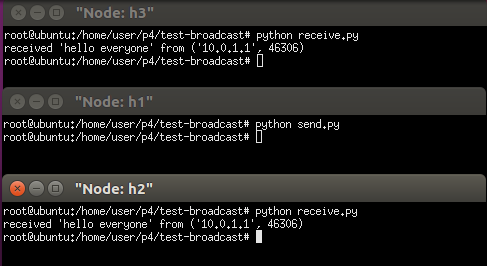

---
# 作業

## 作業一

### 作業環境

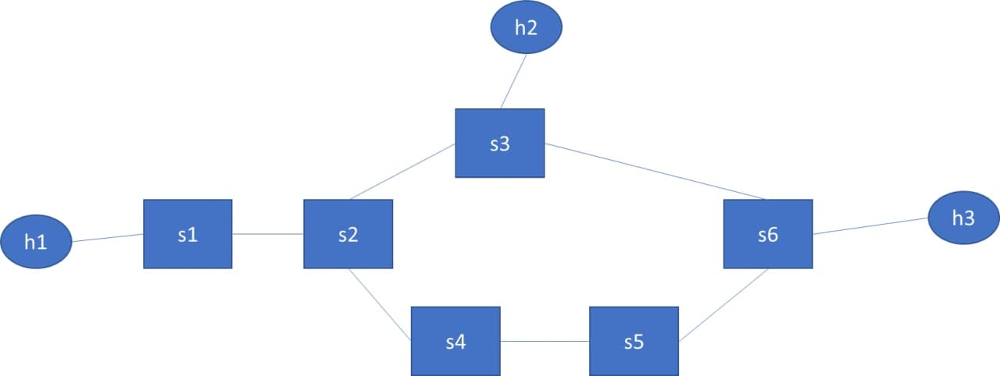

## 作業二

### 作業環境

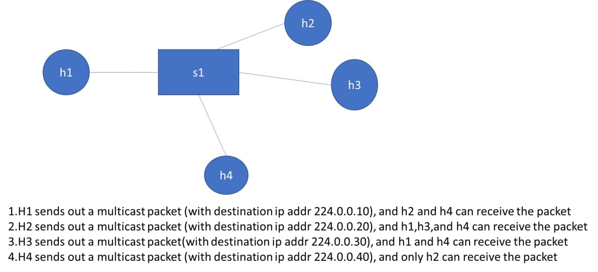

### 程式碼內容

* cmd.txt
  
```sh
table_add mac_forward forward 00:00:0a:00:01:01 => 1
table_add mac_forward forward 00:00:0a:00:01:02 => 2
table_add mac_forward forward 00:00:0a:00:01:03 => 3
table_add mac_forward forward 00:00:0a:00:01:04 => 4

table_add ip_broadcast broadcast 224.0.0.10 1 => 1
table_add ip_broadcast broadcast 224.0.0.20 2 => 2
table_add ip_broadcast broadcast 224.0.0.30 3 => 3
table_add ip_broadcast broadcast 224.0.0.40 4 => 4

mc_mgrp_create 1
mc_node_create 0 2 4 
mc_node_associate 1 0
mc_mgrp_create 2
mc_node_create 1 1 3 4
mc_node_associate 2 1
mc_mgrp_create 3
mc_node_create 2 1 4
mc_node_associate 3 2
mc_mgrp_create 4
mc_node_create 3 2
mc_node_associate 4 3
```

* recevie.py

```sh
import socket
import struct

MCAST_GRP = '224.0.0.40'
MCAST_PORT = 1234
IS_ALL_GROUPS = True

sock = socket.socket(socket.AF_INET, socket.SOCK_DGRAM, socket.IPPROTO_UDP)
sock.setsockopt(socket.SOL_SOCKET, socket.SO_REUSEADDR, 1)
if IS_ALL_GROUPS:
    # on this port, receives ALL multicast groups
    sock.bind(('', MCAST_PORT))
else:
    # on this port, listen ONLY to MCAST_GRP
    sock.bind((MCAST_GRP, MCAST_PORT))
mreq = struct.pack("4sl", socket.inet_aton(MCAST_GRP), socket.INADDR_ANY)

sock.setsockopt(socket.IPPROTO_IP, socket.IP_ADD_MEMBERSHIP, mreq)

while True:
  # For Python 3, change next line to "print(sock.recv(10240))"
  print sock.recv(10240)
```

* send.py

```sh
import socket

MCAST_GRP = '224.0.0.40'
MCAST_PORT = 1234
# regarding socket.IP_MULTICAST_TTL
# ---------------------------------
# for all packets sent, after two hops on the network the packet will not 
# be re-sent/broadcast (see https://www.tldp.org/HOWTO/Multicast-HOWTO-6.html)
MULTICAST_TTL = 2

sock = socket.socket(socket.AF_INET, socket.SOCK_DGRAM, socket.IPPROTO_UDP)
sock.setsockopt(socket.IPPROTO_IP, socket.IP_MULTICAST_TTL, MULTICAST_TTL)

# For Python 3, change next line to 'sock.sendto(b"robot", ...' to avoid the
# "bytes-like object is required" msg (https://stackoverflow.com/a/42612820)
sock.sendto("hello everyone", (MCAST_GRP, MCAST_PORT))
```
### 作業結果

1. h1 -> h2,h4

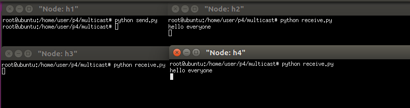

2. h2 -> h1,h3,h4

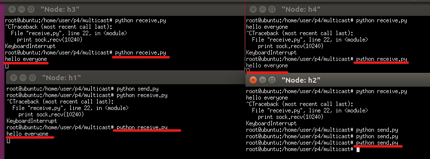

3. h3 -> h1,h4

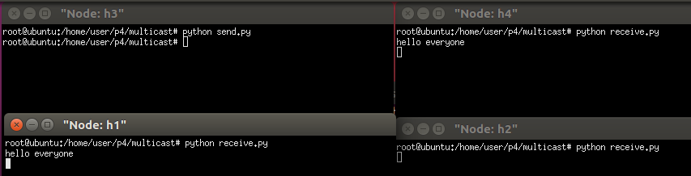

4. h4 -> h2

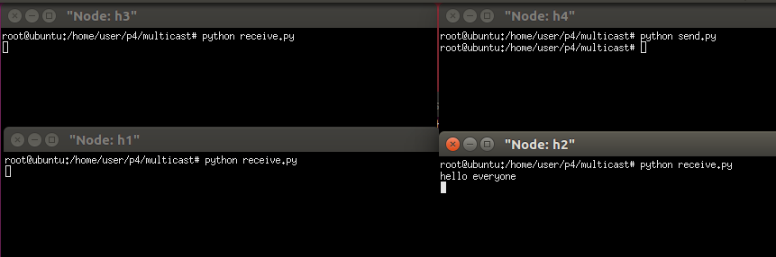

---
## 參考資料
* [Stack Overflow - How do you UDP multicast in Python?](https://stackoverflow.com/questions/603852/how-do-you-udp-multicast-in-python)


