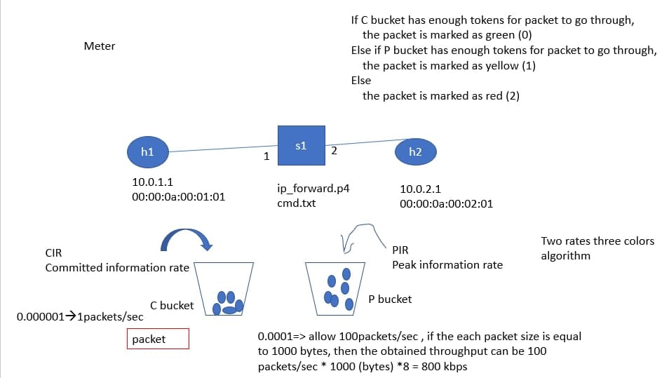
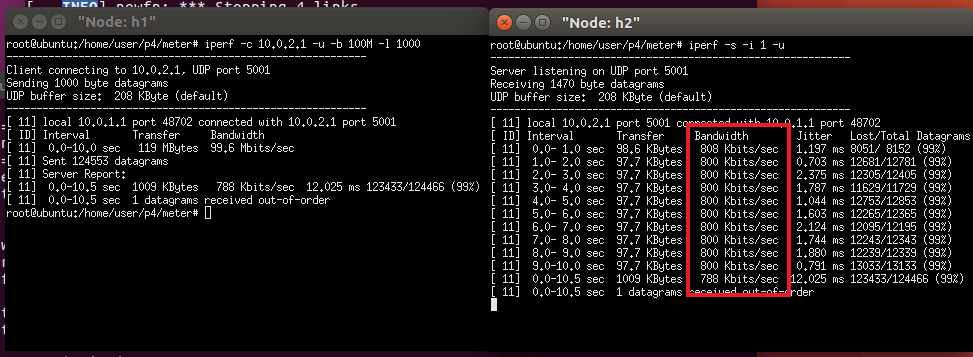
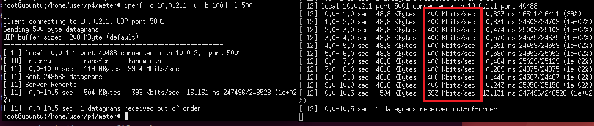
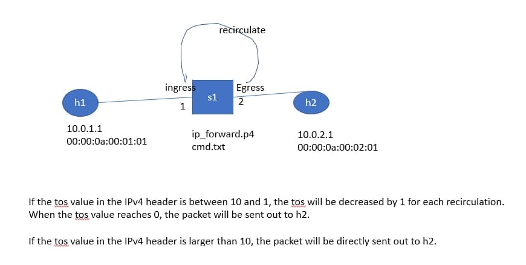
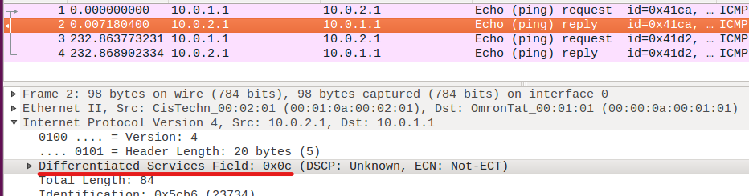
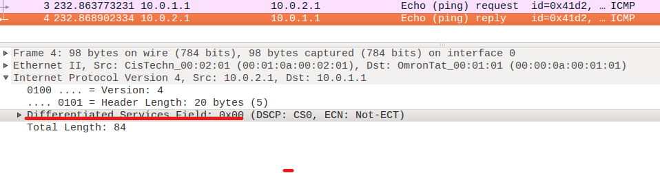
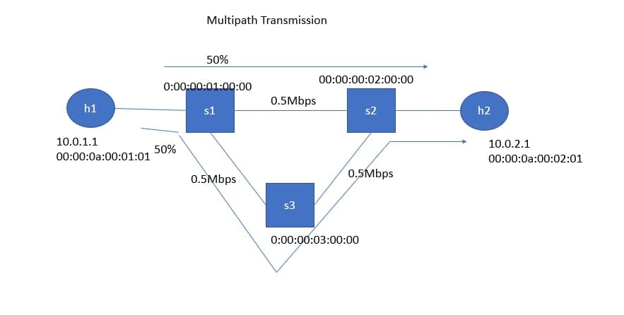
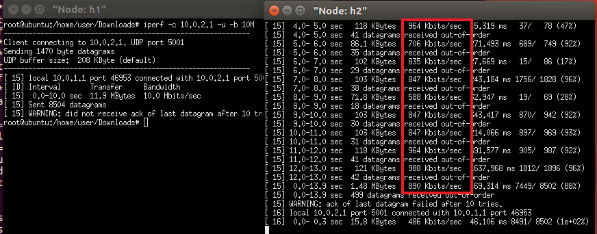
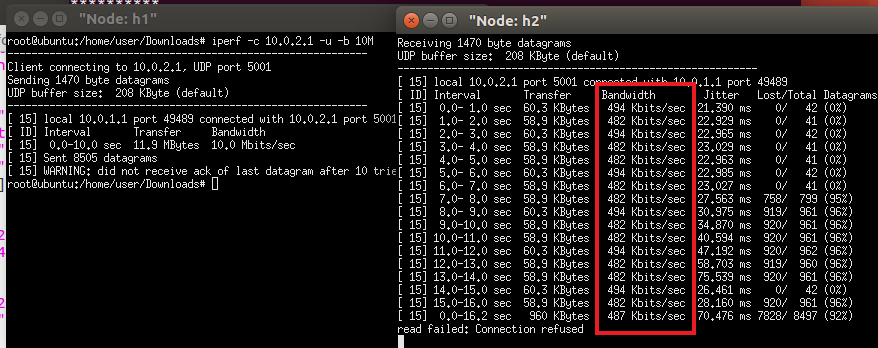

# P4(4)

## Meter

Meter是用來限制傳輸速率的快慢

### 實驗環境



### 程式碼內容

* p4app.json

```sh
.
.
.
  "topology": {
    "assignment_strategy": "manual",
    "auto_arp_tables": "true",
    "auto_gw_arp": "true",
    "links": [["h1", "s1"], ["h2", "s1"]],
    "hosts": {
      "h1": {
        "ip": "10.0.1.1/24",
        "gw": "10.0.1.254"
      },
      "h2": {
        "ip": "10.0.2.1/24",
       "gw": "10.0.2.254"
      }
    },
    "switches": {
      "s1": {
        "cli_input": "cmd.txt",
        "program": "ip_forward.p4"
      }
    }
  }
}
```

* ip_forward.p4

```sh
.
.
.
control ingress(inout headers hdr, inout metadata meta, inout standard_metadata_t standard_metadata) {

    meter(10, MeterType.packets) my_meter;

    //用來給予編號
    action m_action(bit<32> meter_idx) {
        my_meter.execute_meter((bit<32>)meter_idx, meta.meter_tag);
    }      

    action set_tos(bit<8> tos) {
        hdr.ipv4.diffserv=tos;
    }      

    @name(".set_nhop") action set_nhop(macAddr_t dstAddr, egressSpec_t port) {
        //set the src mac address as the previous dst, this is not correct right?
        hdr.ethernet.srcAddr = hdr.ethernet.dstAddr;
 
        //set the destination mac address that we got from the match in the table
        hdr.ethernet.dstAddr = dstAddr;
 
        //set the output port that we also get from the table
        standard_metadata.egress_spec = port;
 
        //decrease ttl by 1
        hdr.ipv4.ttl = hdr.ipv4.ttl - 1;
    }
    @name("._drop") action _drop() {
        mark_to_drop(standard_metadata);
    }
    @name(".ipv4_lpm") table ipv4_lpm {
        actions = {
            set_nhop;
            _drop;
        }
        key = {
            hdr.ipv4.dstAddr: lpm;
        }
        size = 512;
        const default_action = _drop();
    }

     table m_table {
        key = {
            hdr.ethernet.dstAddr: exact;
        }

        actions = {
            m_action;
            NoAction;
        }
        size = 1024;
        default_action = NoAction();
    }

    table m_filter {
        key = {
            meta.meter_tag: exact;
        }

        actions = {
            set_tos;
            _drop;
            NoAction;
        }
        size = 1024;
        default_action = _drop();
    }      
    apply {
        ipv4_lpm.apply();
        m_table.apply();
        m_filter.apply();
    }
}
.
.
.
```

* cmd.txt

```sh
table_add ipv4_lpm set_nhop 10.0.1.1/32 => 00:00:0a:00:01:01 1
table_add ipv4_lpm set_nhop 10.0.2.1/32 => 00:00:0a:00:02:01 2

// 目的端為h2的meter_tag設為2
table_add m_table m_action 00:00:0a:00:02:01 => 2
//若不為0就丟棄
table_add m_filter NoAction 0 =>
//當meter_tag=2的傳輸速率小於1秒有100個封包通過的速率就標為0，介於100到500個封包就標為1，大於500就標為2
meter_set_rates my_meter 2 0.0001:1 0.0005:1
```

### 實驗結果

* 執行iperf
  * h1
  
  `iperf -c  10.0.2.1 -u -b 100M -l 1000`

  * h2
  
  `iperf -s -u -i 1`

* 以長度1000 bytes進行傳送
  
  

* 以長度500 bytes進行傳送
  
  

---
## Recirculate

Recirculate是當封包處理時，可能無法一次就處理完成，所以需再重新回到ingress進行處理，或我們不知道封包需多少次才能處理完成

### 實驗環境



### 程式碼內容

* p4app.json

```sh
.
.
.

  "topology": {
    "assignment_strategy": "manual",
    "auto_arp_tables": "true",
    "auto_gw_arp": "true",
    "links": [["h1", "s1"], ["h2", "s1"]],
    "hosts": {
      "h1": {
        "ip": "10.0.1.1/24",
        "gw": "10.0.1.254"
      },
      "h2": {
        "ip": "10.0.2.1/24",
       "gw": "10.0.2.254"
      }
    },
    "switches": {
      "s1": {
        "cli_input": "cmd.txt",
        "program": "ip_forward.p4"
      }
    }
  }
}
```

* ip_forward.p4

```sh
.
.
.
control egress(inout headers hdr, inout metadata meta, inout standard_metadata_t standard_metadata) {
    action set_mytos() {
        hdr.ipv4.diffserv=hdr.ipv4.diffserv-1;
        recirculate<headers>(hdr);
    }              

    table set_tos {
        key = {
            hdr.ipv4.diffserv: range;
        }

        actions = {
            set_mytos;
            NoAction;
        }

        size = 1024;
        default_action = NoAction();

        const entries = {
        1..10 : set_mytos();
        _ : NoAction();
        }
    }

    apply {
      set_tos.apply();
    }
}
.
.
.
```

* cmd.txt

```sh
table_add ipv4_lpm set_nhop 10.0.1.1/32 => 00:00:0a:00:01:01 1
table_add ipv4_lpm set_nhop 10.0.2.1/32 => 00:00:0a:00:02:01 2
```

### 實驗結果
> 打開wireshark進行觀察
* tos=12

  ```ping 10.0.2.1 -c 1 -Q 12```

  

* tos=5
  
  ```ping 10.0.2.1 -c 1 -Q 5```

  

> 當tos大於10時，tos的值不會發生改變，但tos小於等於10時，tos的值會等於0

---
## Multipath transmission

### 實驗環境



### 程式碼內容

* p4app.json

```sh
{
  "program": "ip_forward.p4",
  "switch": "simple_switch",
  "compiler": "p4c",
  "options": "--target bmv2 --arch v1model --std p4-16",
  "switch_cli": "simple_switch_CLI",
  "cli": true,
  "pcap_dump": false,
  "enable_log": false,
  "topo_module": {
    "file_path": "",
    "module_name": "p4utils.mininetlib.apptopo",
    "object_name": "AppTopoStrategies"
  },
  "controller_module": null,
  "topodb_module": {
    "file_path": "",
    "module_name": "p4utils.utils.topology",
    "object_name": "Topology"
  },
  "mininet_module": {
    "file_path": "",
    "module_name": "p4utils.mininetlib.p4net",
    "object_name": "P4Mininet"
  },
  "topology": {
    "assignment_strategy": "manual",
    "auto_arp_tables": "true",
    "auto_gw_arp": "true",
    "links": [["h1", "s1"], ["h2", "s2"], ["s1", "s2", {"bw":0.5}], ["s1", "s3", {"bw":0.5}], ["s3", "s2", {"bw":0.5}]],
    "hosts": {
      "h1": {
        "ip": "10.0.1.1/24",
        "gw": "10.0.1.254"
      },
      "h2": {
        "ip": "10.0.2.1/24",
       "gw": "10.0.2.254"
      }
    },
    "switches": {
      "s1": {
        "cli_input": "s1-multipath.txt",
        "program": "ip_forward.p4"
      },
      "s2": {
        "cli_input": "s2.txt",
        "program": "ip_forward.p4"
      },	
      "s3": {
        "cli_input": "s3.txt",
        "program": "ip_forward.p4"
      }
    }
  }
}
```

* ip_forward.p4

```sh
/* -*- P4_16 -*- */
#include <core.p4>
#include <v1model.p4>
 
const bit<16> TYPE_IPV4 = 0x800;
 
/*************************************************************************
*********************** H E A D E R S  ***********************************
*************************************************************************/
 
typedef bit<9>  egressSpec_t;
typedef bit<48> macAddr_t;
typedef bit<32> ip4Addr_t;
 
header ethernet_t {
    macAddr_t dstAddr;
    macAddr_t srcAddr;
    bit<16>   etherType;
}
 
header ipv4_t {
    bit<4>    version;
    bit<4>    ihl;
    bit<8>    diffserv;
    bit<16>   totalLen;
    bit<16>   identification;
    bit<3>    flags;
    bit<13>   fragOffset;
    bit<8>    ttl;
    bit<8>    protocol;
    bit<16>   hdrChecksum;
    ip4Addr_t srcAddr;
    ip4Addr_t dstAddr;
}
 
struct metadata {
    macAddr_t dstAddr;
    egressSpec_t port;
    bit<8>  lower;
    bit<8>  upper;      
    bit<8>  result;
    bit<1>  final;
}
 
struct headers {
    ethernet_t   ethernet;
    ipv4_t       ipv4;
}
 
/*************************************************************************
*********************** P A R S E R  ***********************************
*************************************************************************/
 
parser MyParser(packet_in packet,
                out headers hdr,
                inout metadata meta,
                inout standard_metadata_t standard_metadata) {
 
    state start {
        meta.result=127;
        meta.final=0;
        transition parse_ethernet;
    }
 
    state parse_ethernet {
        packet.extract(hdr.ethernet);
        transition select(hdr.ethernet.etherType) {
            TYPE_IPV4: parse_ipv4;
            default: accept;
        }
    }
 
    state parse_ipv4 {
        packet.extract(hdr.ipv4);
        transition accept;
    }
 
}
 
/*************************************************************************
************   C H E C K S U M    V E R I F I C A T I O N   *************
*************************************************************************/
 
control MyVerifyChecksum(inout headers hdr, inout metadata meta) {  
    apply {  }
}
 
 
/*************************************************************************
**************  I N G R E S S   P R O C E S S I N G   *******************
*************************************************************************/
 
control MyIngress(inout headers hdr,
                  inout metadata meta,
                  inout standard_metadata_t standard_metadata) {
    action drop() {
        mark_to_drop(standard_metadata);
    }
   
    action ipv4_forward(macAddr_t dstAddr, egressSpec_t port) {
        standard_metadata.egress_spec = port;
        hdr.ethernet.srcAddr = hdr.ethernet.dstAddr;
        hdr.ethernet.dstAddr = dstAddr;
        hdr.ipv4.ttl = hdr.ipv4.ttl - 1;
    }
   
    table ipv4_lpm {
        key = {
            hdr.ipv4.dstAddr: lpm;
        }
        actions = {
            ipv4_forward;
            drop;
            NoAction;
        }
        size = 1024;
        default_action = NoAction();
    }
 
    action myforward(){
        standard_metadata.egress_spec = meta.port;
        hdr.ethernet.srcAddr = hdr.ethernet.dstAddr;
        hdr.ethernet.dstAddr = meta.dstAddr;
        hdr.ipv4.ttl = hdr.ipv4.ttl - 1; 
        meta.final=1;
    }      
 
    action set_param1(bit<8> lower, bit<8> upper, macAddr_t dstAddr, egressSpec_t port) {
        random(meta.result, (bit<8>)0,(bit<8>)100);
        meta.lower=lower;
        meta.upper=upper;
        meta.dstAddr=dstAddr;
        meta.port=port;
    }
 
    action set_param2(bit<8> lower, bit<8> upper, macAddr_t dstAddr, egressSpec_t port) {
        meta.lower=lower;
        meta.upper=upper;
        meta.dstAddr=dstAddr;
        meta.port=port;
    }
 
    table ipv4_lpm2 {
        key = {
            hdr.ipv4.dstAddr: lpm;
            meta.final: exact;
        }
        actions = {
            set_param1;
            drop;
            NoAction;
        }
        size = 1024;
        default_action = NoAction();
    }
 
    table ipv4_lpm3 {
        key = {
            hdr.ipv4.dstAddr: lpm;
            meta.final: exact;
        }
        actions = {
            set_param2;
            drop;
            NoAction;
        }
        size = 1024;
        default_action = NoAction();
    }
   
    apply {
        if (hdr.ipv4.isValid()) {
            ipv4_lpm2.apply();
            if (meta.result >= meta.lower && meta.result <= meta.upper){
                myforward();
            }
           
            if (meta.final==0){
                ipv4_lpm3.apply();
                if (meta.result >= meta.lower && meta.result <= meta.upper){
                  myforward();
                }
            }
        }
       
        if (hdr.ipv4.isValid() && meta.result==127) {
            ipv4_lpm.apply();
        }
    }
}
 
/*************************************************************************
****************  E G R E S S   P R O C E S S I N G   *******************
*************************************************************************/
 
control MyEgress(inout headers hdr,
                 inout metadata meta,
                 inout standard_metadata_t standard_metadata) {
    apply {  }
}
 
/*************************************************************************
*************   C H E C K S U M    C O M P U T A T I O N   **************
*************************************************************************/
 
control MyComputeChecksum(inout headers  hdr, inout metadata meta) {
     apply {
        update_checksum(
            hdr.ipv4.isValid(),
            { hdr.ipv4.version,
              hdr.ipv4.ihl,
              hdr.ipv4.diffserv,
              hdr.ipv4.totalLen,
              hdr.ipv4.identification,
              hdr.ipv4.flags,
              hdr.ipv4.fragOffset,
              hdr.ipv4.ttl,
              hdr.ipv4.protocol,
              hdr.ipv4.srcAddr,
              hdr.ipv4.dstAddr },
            hdr.ipv4.hdrChecksum,
            HashAlgorithm.csum16);
    }
}
 
/*************************************************************************
***********************  D E P A R S E R  *******************************
*************************************************************************/
 
control MyDeparser(packet_out packet, in headers hdr) {
    apply {
        packet.emit(hdr.ethernet);
        packet.emit(hdr.ipv4);
    }
}
 
/*************************************************************************
***********************  S W I T C H  *******************************
*************************************************************************/
 
V1Switch(
MyParser(),
MyVerifyChecksum(),
MyIngress(),
MyEgress(),
MyComputeChecksum(),
MyDeparser()
) main;
```

* s1-multipath.txt

```sh
 table_set_default ipv4_lpm drop
 table_add ipv4_lpm ipv4_forward 10.0.1.1/32 => 00:00:00:00:01:01 1
 table_add ipv4_lpm2 set_param1 10.0.2.1/32 0 => 0   49 00:00:00:02:00:00 2
 table_add ipv4_lpm3 set_param2 10.0.2.1/32 0 => 50 100 00:00:00:03:00:00 3
```

* s2.txt

```sh
table_set_default ipv4_lpm drop
table_add ipv4_lpm ipv4_forward 10.0.1.1/32 => 00:00:00:01:00:00 2
table_add ipv4_lpm ipv4_forward 10.0.2.1/32 => 00:00:0a:00:02:01 1
```

* s3.txt

```sh
table_set_default ipv4_lpm drop
table_add ipv4_lpm ipv4_forward 10.0.1.1/32 => 00:00:00:01:00:00 1
table_add ipv4_lpm ipv4_forward 10.0.2.1/32 => 00:00:00:02:00:00 2
```

### 實驗結果

執行`iperf`觀察數值

* multipath
  
  

* singlepath
  
  

---
# 作業

### 作業環境


